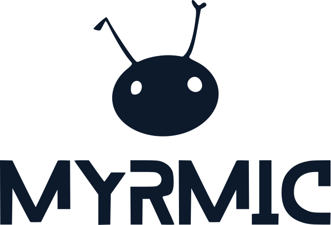

<p align="center">
  
</p>

<p align="center">
Myrmic is an open-source runtime for distributed edge applications, developed by <a href="https://peeriot.io">Peeriot</a> - built for heterogeneous environments where microcontrollers, gateways, and servers coordinate locally without a central cloud controller making decisions. You write application logic, not infrastructure - Myrmic handles execution, messaging, state, and placement.
</p>

<p align="center">
  <a href="#project-status"></a>
  <a href="rust-toolchain.toml"></a>
</p>

Myrmic unifies compute, persistence, messaging, and hardware access into a single runtime model that works the same across heterogeneous devices and changing network topologies. Applications are written as **Cells** - message-driven, stateful modules - that run on a dedicated **Runtime**, coordinate through a **Self-Organization Layer**, and share state through a distributed **Data Layer**. This replaces the usual stack of separate orchestrators, brokers, and databases with one integrated, edge-native platform that stays resilient under intermittent connectivity and device failures.

This repository is the Myrmic monorepo. It contains the OS-targeted implementation, embedded SoC ports, and the WebAssembly SDK and tooling used to build and deploy Cells.

## Project Status

Myrmic is **experimental and under active development**. Interfaces, APIs, and the on-disk/on-wire formats may change without notice, and some documented workflows are still aspirational. It is not yet recommended for production use.

## Scope & Limitations

Myrmic is designed exclusively for use within the bounds described below. Use outside these limits is at your own risk.

- **Soft real-time only.** Not designed for hard real-time with deterministic deadlines under 1 ms; latency jitter of 10–500 ms may occur. No TSN / isochronous synchronization.
- **Non-critical processes only.** Use in safety-critical control (e.g. motor control, emergency-stop, anything whose malfunction could endanger life) is expressly excluded. No certified safe-state mechanism; GPIO state on crash is undefined.
- **Eventual consistency.** The system prioritizes availability over consistency (AP under CAP). Transactions requiring atomic real-time consistency (e.g. financial postings) are not supported.
- **No functional-safety guarantees.** Resilience targets up to high availability (1oo2 / 2oo3); fault tolerance beyond this is excluded.

## Getting Started

The complete documentation is published as a handbook at **[book.myrmic.dev](https://book.myrmic.dev)**, with the generated API reference at **[docs.myrmic.dev](https://docs.myrmic.dev)**. The handbook sources also live in this repository under [`doc/chapters/`](doc/chapters/) - see [SUMMARY.md](SUMMARY.md) for the full table of contents.

## Supported Targets

| Target    | Architecture      | Runtime        | Notes                                                                  |
|-----------|-------------------|----------------|------------------------------------------------------------------------|
| Linux     | x86_64 / aarch64  | Wasmtime (JIT) | No fixed resource limit                                                |
| ESP32-C5  | RISC-V (rv32imac) | WAMR (AOT)     | 184 KB internal heap (120 KB + 64 KB dram2) + PSRAM, up to 16 MB flash |
| ESP32-C6  | RISC-V (rv32imac) | WAMR (AOT)     | 336 KB heap (272 KB + 64 KB dram2), up to 8 MB flash                   |
| ESP32-C61 | RISC-V (rv32imac) | WAMR (AOT)     | 160 KB internal heap (96 KB + 64 KB dram2) + PSRAM, up to 8 MB flash   |

Planned / in progress: macOS, Windows, and nRF5340 (Arm Cortex-M33). At the moment only Linux and Espressif SoCs are supported.

## Repository Layout

| Path | Contents |
|---|---|
| [`swarm/`](swarm/) | OS-targeted implementation and platform crates (runtime, data layer, self-organization, CLIs). |
| [`embedded/`](embedded/) | Embedded implementations per SoC family (currently Espressif), plus device examples. |
| [`sdk/`](sdk/) | WebAssembly SDK, codegen, and example modules for building Cells. |
| [`doc/`](doc/) | Project documentation (chapters and images). |

## Building from Source

Myrmic is built with Rust (edition 2024). The components and targets it needs are declared in [rust-toolchain.toml](rust-toolchain.toml), and `rustup` applies them automatically when you build:

```bash
cargo build --bin myrmic
```

Building cells or the embedded firmware requires additional setup (toolchains, target triples, and flashing tools). See the [Quickstart](doc/chapters/01_quickstart.md) and [CONTRIBUTING.md](CONTRIBUTING.md).

## Community & Support

Myrmic is built in the open, and community input helps shape its direction.

- **Questions & discussion:**  [GitHub Discussions](https://github.com/peeriot/myrmic/discussions) ·  [Discord](https://discord.gg/zExh79pWgj)
- **Bug reports:** Open a  [GitHub Issue](https://github.com/peeriot/myrmic/issues) with a minimal reproduction and logs.
- **Contact:**  [contact@myrmic.dev](mailto:contact@myrmic.dev) - project inquiries. Myrmic is a community project: help is best-effort through the channels above, without commercial support or response-time commitments.
- **Updates & demos:**  [@MyrmicOfficial](https://x.com/MyrmicOfficial) ·  [@MyrmicOfficial](https://www.youtube.com/@MyrmicOfficial)

## Contributing

Contributions of all sizes are welcome - documentation fixes, demos and examples, and code improvements all matter. Start with [CONTRIBUTING.md](CONTRIBUTING.md), and if you are new to the GitHub workflow, see the [Open Source Guide](https://opensource.guide/how-to-contribute/).

Please be respectful and constructive; all contributors are expected to follow our [Code of Conduct](CODE_OF_CONDUCT.md).

## Security

Please report security issues **privately** rather than opening a public issue. See our [Security policy](SECURITY.md) for details on how to report a vulnerability and the project's security model.

## License

Myrmic includes components under different open source licenses. The platform is licensed under **GPL-2.0-only** together with the **Myrmic Exception**; the SDK and all interface crates are licensed under **MIT OR Apache-2.0**; examples and templates are licensed under **MIT-0**; the documentation is licensed under **CC-BY-4.0**.

**In practice:** Independently developed applications you build on Myrmic - including Cells via the SDK, signal-layer modules and pipelines - may be licensed under terms of your choice, including proprietary terms, if they meet the requirements of the Myrmic Exception. The Exception permits such applications to be distributed together with the GPL-2.0-only covered platform without becoming subject to GPL-2.0-only solely because of that combination. Changes to the platform itself remain subject to GPL-2.0-only when distributed. A separate commercial license may be available for code that Peeriot GmbH is entitled to license commercially, including under the applicable EdgeVance subscription terms.

See [LICENSING.md](LICENSING.md) for a non-binding plain-language overview, [`LICENSES/`](LICENSES/) for the authoritative texts, and [`EXCEPTION-SCOPE.md`](EXCEPTION-SCOPE.md) for the interfaces, licenses and code generators identified for the purpose of the Myrmic Exception.

"Myrmic", "EdgeVance", and "Peeriot" are trademarks of Peeriot GmbH. The Myrmic logo and other brand assets are not covered by the licenses applicable to the software or documentation; Peeriot's trademark policy will be published separately.

---

Copyright © Peeriot GmbH <contact@myrmic.dev>.
Contains third-party code under separate licenses; see [NOTICE](NOTICE).
