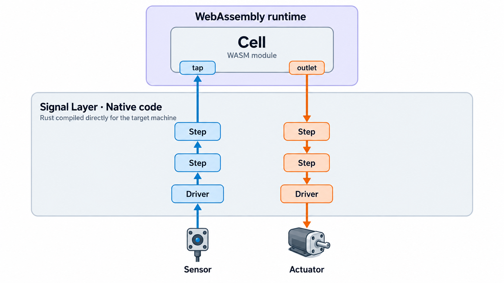

# First Steps with the Signal Layer

In this tutorial you build the smallest complete Signal Layer system: a pipeline that produces a
value, a cell that reads it, and then the payoff — moving that cell from a Linux machine onto an
ESP32 with one command, without changing a line of it.

You write two small YAML files and about thirty lines of Rust. `myrmic new` scaffolds the rest,
and everything else is generated at build time.



## What you build

A simulated sensor publishes a climbing value twice a second. A `moving-average` step smooths it.
Both numbers are offered as *taps*, named values a cell can read. Your cell reads them every
second and logs them.

The point of the exercise is what does *not* change along the way. The pipeline file and the cell
run on a Linux machine first, and on an ESP32-C6 after. Only the *board file*, the description of
the physical machine, differs between the two.

## What you need

Every `myrmic new` in this tutorial builds the project it scaffolds against a checkout of the
Myrmic repository. Point the CLI at yours **before you scaffold anything**, and every command below
picks it up with no `--sdk` flag to repeat:

```bash
export PEERIOT_MYRMIC_SDK=~/myrmic   # the checkout Install from source left you; use your own path
```

Set it once, in the shell you run the tutorial from, before the first `myrmic new`. Setting it
afterwards does not repair an already-scaffolded project: it is read only while a project is
created. You can pass `--sdk <path>` on any single command instead, and it wins when both are set.

Without a checkout to point at, a source-built CLI writes an SDK dependency your machine cannot
fetch, and the next build fails with `revspec '...' not found`. Set the variable (or pass `--sdk`)
and the generated project builds against your checkout.

**Part 1 and 2, the Linux half:**

- A Linux machine. The simulated sensor is synthetic and never touches the I²C bus, so this
  tutorial needs no I²C hardware and no `/dev/i2c-*` node. (A Raspberry Pi works too — it is where
  the real-sensor follow-ups in *What's next* would run.)
- The `myrmic` CLI and the Rust toolchain it builds cells with, per
  [Installation](../01_quickstart/01_installation.md). The *Install from source* path also leaves
  you the checkout referenced above (called `~/myrmic` here).

**Part 3, the ESP32 half:**

- An ESP32-C6 devkit and a machine to flash it from (that machine also needs the repo checkout).
- The extra embedded prerequisites. A firmware scaffolded by `myrmic new --firmware` ships a
  `rust-toolchain.toml` pinning `nightly-2026-08-07`, the `rust-src` component and the
  `riscv32imac-unknown-none-elf` target, so rustup installs all of it on the first firmware build -
  you do not have to set the toolchain up by hand. To install it ahead of that build (e.g. for an offline environment), 
  these steps are optional:

  ```bash
  rustup toolchain install nightly-2026-08-07 --component rust-src
  rustup target add riscv32imac-unknown-none-elf --toolchain nightly-2026-08-07
  ```

  And `wamrc` **2.4.4**, the ahead-of-time compiler cells are compiled with for the device. It is
  built from the WAMR sources against your system LLVM (packages: `cmake`, `ninja-build`,
  `llvm-dev`, `clang`; LLVM 18 and 19 both work):

  ```bash
  mkdir -p ~/wamr-build && cd ~/wamr-build
  curl -fsSL https://github.com/bytecodealliance/wasm-micro-runtime/archive/refs/tags/WAMR-2.4.4.tar.gz | tar -xz
  SRC=~/wamr-build/wasm-micro-runtime-WAMR-2.4.4
  mkdir -p "$SRC/core/deps/llvm"
  ln -sfn /usr/lib/llvm-19 "$SRC/core/deps/llvm/build"   # adjust to your LLVM version
  cmake -S "$SRC/wamr-compiler" -B build -G Ninja -DCMAKE_BUILD_TYPE=Release
  cmake --build build
  install -m 755 "$(readlink -f build/wamrc)" ~/.cargo/bin/wamrc
  wamrc --version   # wamrc 2.4.4
  ```
- WiFi credentials for the network the Linux machine is on. The device discovers the runtime by
  multicast; a fallback for networks that block it is in Part 3.

## The parts

1. [The pipeline](03_first-steps-signal-layer/01_the-pipeline.md): describe the machine and the
   dataflow, scaffold the pipeline, and watch it run.
2. [The cell](03_first-steps-signal-layer/02_the-cell.md): start a runtime, write a thermometer
   cell, and read the taps.
3. [The transfer](03_first-steps-signal-layer/03_the-transfer.md): put the same pipeline onto an
   ESP32-C6 and move the same cell onto it.

Along the way, the [Signal Layer guide](../05_guides/11_signal-layer.md) explains every concept
this tutorial uses; the [reference](../10_reference/04_signal-layer.md) holds the full file
formats.
