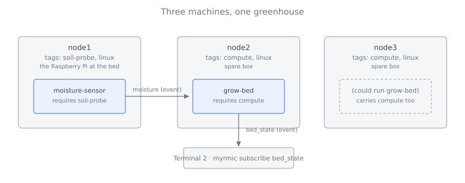

# Resilience

In this tutorial you take two cells from the [Smart Greenhouse](./02_smart-greenhouse.md) - the mock sensor and the grow-bed - and run them across three Myrmic runtimes standing in for three machines. Then you start killing runtimes and watch what the swarm does about it.

You learn three things that together make up *resilience* in Myrmic today: where a cell may run (placement tags), what happens to a cell when its runtime dies (restart policy), and what happens to its **state** - which is a separate question, and the one that matters most.

> **Preview version.** What this tutorial shows is the *manual* approach available today: you decide with the CLI where a cell may run, whether it is restarted, and on which nodes copies of its state are kept. A more robust approach, in which the swarm keeps a cell and its state alive by itself, with faster response time, is on the [Roadmap](../09_roadmap.md). Nothing here is part of the [guarantee contract](../08_guarantees.md) yet.

## The Setting

Picture a real greenhouse with three computers:

| Runtime | Stands for | Tags | Runs |
|---|---|---|---|
| `node1` | the Raspberry Pi wired to the soil probe at the bed | `soil-probe` | `moisture-sensor` |
| `node2` | a spare box in the back room | `compute` | `grow-bed`, or a copy of its state |
| `node3` | a second spare box | `compute` | `grow-bed`, or a copy of its state |

The sensor can only run where the probe is wired in - on `node1`. The grow-bed is pure software and can run on either spare box. Software cannot make a unique probe redundant; it *can* make the state derived from it redundant. That difference is the whole tutorial.

Ideally you would have three machines. You do not need them: three runtimes on one computer behave exactly the same, and that is what you will use here.

## Prerequisites

- Completed [Part 1](./02_smart-greenhouse/01_the-mock-sensor.md) and [Part 3](./02_smart-greenhouse/03_the-grow-bed.md) of the Smart Greenhouse: the `moisture-sensor` and `grow-bed` crates exist in your `greenhouse/` directory and build.
- For the finale, the complete Smart Greenhouse, including its `app_specs.yml` from [Part 6](./02_smart-greenhouse/06_the-finale.md).
- No Myrmic runtime running. If one is, stop it: `myrmic runtimes delete <name>`.

You will use two terminals:

| Terminal | Runs |
|---|---|
| Terminal 1 | your working shell: start and kill runtimes, deploy, send |
| Terminal 2 | `myrmic subscribe` - a live view of the events |

## Tutorial Parts

1. [The Sensor and Its Node](./03_resilience/01_the-sensor-and-its-node.md) - start three tagged runtimes, pin the sensor to one, kill that runtime and bring it back - **learning how placement tags and a restart policy work.**
2. [The Grow-Bed and Its State](./03_resilience/02_the-grow-bed-and-its-state.md) - deploy the grow-bed, find out where its state is kept, kill the node it runs on, and see when the state survives - and how to make that likely - **learning that a cell's state lives in one place unless you ask for copies.**
3. [The Whole Greenhouse](./03_resilience/03_the-whole-greenhouse.md) - fold placement and restart into the application specification and replicate the whole application - **learning how the pieces fit together in one deployment.**
