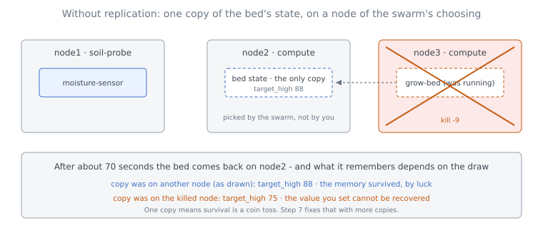
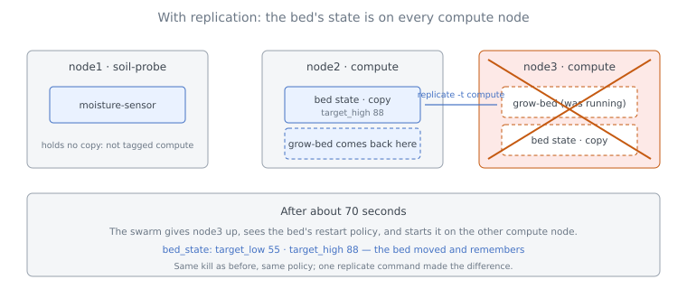

# Part 2 - The Grow-Bed and Its State

This is Part 2 of the [Resilience](../03_resilience.md) tutorial. You deploy the grow-bed on the spare boxes, find out where the swarm keeps its state, and kill the node it runs on - twice. The first time, whether the bed remembers is a matter of luck. The second time, you have made it likely. Along the way you learn the most important fact about state in Myrmic today: unless you ask for copies, it exists in **one**.



---

## Step 4 - Deploy the Grow-Bed

The grow-bed is pure software. It may run on either spare box, and never on the Raspberry Pi:

```bash
myrmic deploy grow-bed -t compute --policy always
```

```text
INFO  deploying cell (srn = grow-bed, sri = fd02ce9b-180a-540e-8f18-c8f59eeb4a05)
INFO  deployed cell (srn = grow-bed, sri = fd02ce9b-180a-540e-8f18-c8f59eeb4a05)
```

```bash
myrmic cells
```

```text
  cell             sri                                   kind  runtime     age  policy  class            srn
──── grow-bed ──────────────────────────────────────────────────────────────────────────────────────────────────────────
  grow-bed         fd02ce9b-180a-540e-8f18-c8f59eeb4a05  wasm  [4]f741c9b  6s   always  grow-bed         grow-bed
──── moisture-sensor ───────────────────────────────────────────────────────────────────────────────────────────────────
  moisture-sensor  365d6cfe-e9c2-5914-bfed-3a17d4ecd6da  wasm  [1]12a7f3f  14s  always  moisture-sensor  moisture-sensor
```

Here the grow-bed landed on `node3`; yours may say `node2`. Either is right - the swarm picks one of the qualifying nodes. What it will never say for the grow-bed is `node1`.

Point Terminal 2 at the bed instead of the sensor:

```bash
myrmic subscribe bed_state
```

```text
[2026-09-06T18:58:53.954Z] event=bed_state sender=fd02ce9b-... payload=75 bytes
{
  "moisture": 62.399895,
  "pump_on": false,
  "target_high": 75.0,
  "target_low": 55.0
}
```

The sensor on `node1` publishes, the grow-bed on `node3` reacts - across two runtimes, without either cell knowing or caring. The targets are the grow-bed's built-in defaults: 55 to 75.

Those defaults are what the bed knows *without* any memory. To tell later whether its memory survived, you need a value that is not the default. Raise the upper target:

```bash
myrmic send grow-bed set_target '{"low": 55, "high": 88}'
```

Terminal 2 now shows `"target_high": 88.0` on every `bed_state`. That **88** is your marker. Whenever you see 75 again, the bed has lost its memory.

---

## Step 5 - Where Is the Bed's State?

The grow-bed's state - moisture, pump flag, targets - is stored in Myrmic's distributed database, the *data layer*. The default behaviour today is a single copy of that state, and since this is a distributed system, that copy may or may not be on the node the cell runs on. To check where it is, ask:

```bash
myrmic replicate
```

```text
TARGET                                              TAGS
scope:CELLS/365d6cfe-e9c2-5914-bfed-3a17d4ecd6da/p  @ca157d28d8cf44689a97832a30327a8c (provisional)
scope:CELLS/@events/bed_state                       @4f741c9b645144daa3d0e8776399c7bf (provisional)
scope:CELLS/@events/moisture                        @4f741c9b645144daa3d0e8776399c7bf (provisional)
scope:CELLS/fd02ce9b-180a-540e-8f18-c8f59eeb4a05/p  @ca157d28d8cf44689a97832a30327a8c (provisional)
scope:tele                                          @ca157d28d8cf44689a97832a30327a8c
```

`myrmic replicate` is the command that decides which nodes hold copies of which data. You have not used it yet, so every row is marked `(provisional)`: the swarm had to put the data *somewhere* and picked a node on its own.

The rows are keyed by the cell's `sri`, so first look up the grow-bed's:

```bash
myrmic cells | grep grow-bed
```

```text
  grow-bed         fd02ce9b-180a-540e-8f18-c8f59eeb4a05  wasm  [4]f741c9b  2m   always  grow-bed         grow-bed
```

Now find that `sri` in the listing above: the row `scope:CELLS/fd02ce9b-.../p`. Its `TAGS` column names exactly one node, by id: `@ca157d28...`. Look that id up in `myrmic network status`: it is `node2`.

So the grow-bed *runs* on `node3` while its state is *kept* on `node2`. That is neither a mistake nor a special case. **Where a cell runs and where its state is kept are two separate decisions, and they do not have to agree.** The swarm should place the cell by its tags and place its data where it best serves the application as a whole, so the two can end up on different nodes, as they did here. Until you say otherwise, the data placement is the swarm's own choice - and it is one copy, on one node. In your swarm the copy may sit on any of the three nodes, including the one running the bed. Write down which one it is - you will need it in the next step.

---

## Step 6 - Kill the Node Running the Bed

Find the process id of the node the bed runs on - `node3` here - and kill it:

```bash
myrmic runtimes list
kill -9 <pid of node3>
```

Terminal 2 goes quiet: the bed is gone, nobody publishes `bed_state`. The sensor keeps publishing `moisture` into the void.

Wait. **After about 70 seconds** the swarm gives `node3` up, notices the grow-bed's restart policy, and starts it again on the only other node that qualifies:

```bash
myrmic cells
```

```text
  cell             sri                                   kind  runtime     age  policy  class            srn
──── grow-bed ──────────────────────────────────────────────────────────────────────────────────────────────────────────
  grow-bed         fd02ce9b-180a-540e-8f18-c8f59eeb4a05  wasm  [c]a157d28  9s   always  grow-bed         grow-bed
──── moisture-sensor ───────────────────────────────────────────────────────────────────────────────────────────────────
  moisture-sensor  365d6cfe-e9c2-5914-bfed-3a17d4ecd6da  wasm  [1]12a7f3f  36m  always  moisture-sensor  moisture-sensor
```

Same `sri`, new runtime: the grow-bed now runs on `node2`. The cell is back. Now look at Terminal 2 for the question that matters - what does it *remember*?

There are two possible answers, and Step 5 told you which one you will get:

- **The state was kept on a different node than the one you killed.** Then the bed comes back with `"target_high": 88.0`. It moved, and its memory came with it, because the memory was never on the dead node in the first place.
- **The state was kept on the node you killed.** Then the bed comes back with `"target_high": 75.0`. The cell was restarted; its one copy of state was on the dead node and is gone with it. The value you set cannot be recovered.

In the walk-through the state was on `node2`, so the bed came back with 88. Had it landed on `node3` when it was written, the same kill would have produced 75. Nothing you did as a developer made the difference; the swarm's choice of node did. That is the honest summary of the preview's default: the state of a cell has **one copy**, and whether it survives the loss of a node is luck.

Bring `node3` back before going on:

```bash
myrmic runtimes start -n node3 --tag compute --detached
```

---

## Step 7 - Make the Cell State Resilient

If one copy makes survival a matter of luck, the fix is more copies. Tell the swarm that the grow-bed's data is to be kept on every node tagged `compute`:

```bash
myrmic replicate grow-bed -t compute
```

```text
TARGET                                              TAGS
grow-bed                                            compute
scope:CELLS/365d6cfe-e9c2-5914-bfed-3a17d4ecd6da/p  @ca157d28d8cf44689a97832a30327a8c (provisional)
...
```

Read the new first row: *the grow-bed's data is held by every node tagged `compute`* - that is `node2` and `node3`, and never `node1`. Both spare boxes now hold a copy, and the provisional single copy has been superseded. Notice what the command did **not** ask for: a node name. A replication set names what a node must *be*, not which node it is. Add a fourth spare box tagged `compute` tomorrow and it starts holding a copy without you touching this configuration.

Give the swarm a few seconds to copy the data over, then set your marker again, in case it was lost in Step 6:

```bash
myrmic send grow-bed set_target '{"low": 55, "high": 88}'
```

Now repeat Step 6: find the node the bed runs on, kill it, wait **about 70 seconds**.

```text
[2026-09-06T19:34:59.524Z] event=bed_state sender=fd02ce9b-... payload=75 bytes
{
  "moisture": 62.597828,
  "pump_on": false,
  "target_high": 88.0,
  "target_low": 55.0
}
```

**88.** The bed is on the other spare box and remembers, and this time it is not luck: whichever `compute` node died, the other one held a copy of everything the bed had ever saved. Bring the killed node back; because the replication set says so, it resumes holding a copy of the bed's state without further configuration.



---

## What Have You Learned

- A cell's state lives in the swarm's database, on a node the swarm picks - **independently of where the cell runs**. `myrmic replicate` shows which; `(provisional)` means you did not choose it.
- By default there is **one copy**. Kill the node holding it and the state is gone, even though `--policy always` brings the cell back within about 70 seconds. Kill any other node and the state survives - by luck, not design.
- `myrmic replicate <cell> -t <tag>` keeps a copy on every node with that tag. With copies on both spare boxes, losing either one leaves the bed's memory intact.
- Restart policy and replication answer different questions: "does the cell come back?" and "does the cell remember?". You need both.

Next: [Part 3 - The Whole Greenhouse](./03_the-whole-greenhouse.md), where this becomes one file and one command.
