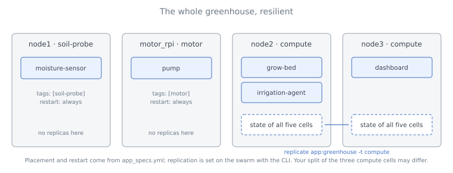

# Part 3 - The Whole Greenhouse

This is the last part of the [Resilience](../03_resilience.md) tutorial. You add a fourth runtime for the pump, fold what you did by hand - placement tags and restart policies - into the application specification, bring the whole greenhouse up with one command, and replicate the application as a whole.

---

## Step 8 - Placement and Restart in the App Spec

You have been deploying cells one at a time with flags. An application ships as one file - you built that file in the Smart Greenhouse finale. Remove the two hand-deployed cells and the cell-level replication set first:

```bash
myrmic delete --cell grow-bed
myrmic delete --cell moisture-sensor
myrmic replicate grow-bed -e compute
```

The full greenhouse has a second piece of hardware: the pump. In a real installation it is a relay wired to its own Raspberry Pi, so the pump cell can only run there. Start a fourth runtime standing in for that machine, with a tag that says what it has:

```bash
myrmic runtimes start -n motor_rpi --tag motor --detached
```

Then edit `greenhouse/app_specs.yml`. The `classes` section is unchanged; each instance gains a `tags` line and a `restart` line:

```yaml
name: greenhouse

classes:
  - id: moisture-sensor
    build: ./moisture-sensor
  - id: pump
    build: ./pump
  - id: grow-bed
    build: ./grow-bed
  - id: dashboard
    build: ./dashboard
  - id: irrigation-agent
    build: ./irrigation-agent

instances:
  - class: moisture-sensor
    tags: [soil-probe]
    restart: always
  - class: pump
    tags: [motor]
    restart: always
  - class: grow-bed
    tags: [compute]
    restart: always
  - class: dashboard
    tags: [compute]
    restart: always
  - class: irrigation-agent
    tags: [compute]
    restart: always
```

The sensor is pinned to the probe and the pump to the motor; everything else may run on either spare box and comes back if its box dies. Deploy it:

```bash
myrmic deploy app_specs.yml
myrmic cells
```

```text
  cell              sri                                   kind  runtime     age  policy  class             srn
──── greenhouse ───────────────────────────────────────────────────────────────────────────────────────────────────────────
  dashboard         884f63a0-83ed-52fe-b67c-2bcfb6df378c  wasm  [4]f741c9b  8s   always  dashboard         dashboard
  grow-bed          fd02ce9b-180a-540e-8f18-c8f59eeb4a05  wasm  [c]a157d28  8s   always  grow-bed          grow-bed
  irrigation-agent  9f2172bd-73ff-5dba-a7a7-33b0e8756faa  wasm  [c]a157d28  8s   always  irrigation-agent  irrigation-agent
  moisture-sensor   365d6cfe-e9c2-5914-bfed-3a17d4ecd6da  wasm  [1]12a7f3f  8s   always  moisture-sensor   moisture-sensor
  pump              4e9ba24d-b959-57bf-9b71-73500c8e5495  wasm  [7]7b3e0a2  8s   always  pump              pump
```

The sensor sits on `node1` and the pump on `motor_rpi`. The other three are spread over `node2` and `node3` - here grow-bed and agent on one, dashboard on the other. Your split may differ; what cannot differ is that none of the three is on `node1` or `motor_rpi`.



---

## Step 9 - Replicate the Application

One thing does **not** live in the app spec: replication. Which nodes hold copies of which data is a decision about the swarm, made with the CLI, and it stays in place across redeployments of the application. Replicate the whole application at once:

```bash
myrmic replicate app:greenhouse -t compute
```

```text
TARGET                                              TAGS
app:greenhouse                                      compute
...
```

`app:greenhouse` covers every cell of the application - the ones deployed now, and any you add to the file later. Every cell's state is now on both spare boxes; kill either box and the cells on it come back on the other within about 70 seconds, remembering everything. Try it: point Terminal 2 at `myrmic subscribe bed_state,watering_started,watering_stopped` and pull a plug.

---

## Step 10 - Clean Up

```bash
myrmic delete greenhouse --app
myrmic replicate app:greenhouse -e compute
myrmic runtimes delete node1 node2 node3 motor_rpi
```

---

## What Have You Built

A greenhouse that survives losing a machine:

- The **sensor** and the **pump** are each pinned to the one machine that has their hardware (`soil-probe`, `motor`). If that machine dies, the cell stops - no software can help with that - and comes back by itself when the machine is back.
- The **grow-bed**, and every other software-only cell, may run on either spare box (`compute`), restarts on the other one when its box dies (`restart: always`), and remembers what it knew because its state was on both (`myrmic replicate ... -t compute`).
- Placement and restart travel with the application in `app_specs.yml`; replication is configured on the swarm with `myrmic replicate`.

## What Have You Learned

- **State has one copy by default**, on a node the swarm picks independently of where the cell runs. A restart policy brings a cell back; only replication makes its memory likely to survive.
- **Tags do double duty.** The same words decide where a cell may run and where its data may be kept. `compute` kept the bed and its copies off `node1` throughout.
- **Name what a node must be, not which node it is.** A tag-based replication set follows nodes as they come and go.
- **Expect about a minute.** Noticing a dead node and restarting its cells takes around 70 seconds in the current release; a cell that can only run on one node comes back a few seconds after that node does.

> **Preview version.** Everything in this tutorial is the *manual* approach: you chose the tags, the restart policy and the replication set by hand, and the swarm did exactly that and no more. A cell does not resume mid-handler - the copy of a moment ago is what comes back - and none of this is yet part of the [guarantee contract](../../08_guarantees.md). The [Roadmap](../../09_roadmap.md) describes the stages that turn today's configuration into something the swarm does by itself, robustly: keeping a cell, its authority and its state alive across the loss of a node without an operator in the loop.

## Where to Go Next

- [`myrmic replicate`](../../10_reference/02_myrmic-cli/15_replicate.md) - the full reference: replicating a single cell, an application, or a shared scope; files; pinning to a node.
- [`restart`](../../10_reference/01_configuration/02_cell-and-application-configuration.md#restart) - the restart policies and their crash-loop bounds.
- [Guarantees](../../08_guarantees.md) and [Failure Behaviour](../../07_architecture/04_failure-behaviour.md) - what the current release promises when a node is lost, and what is coming.
