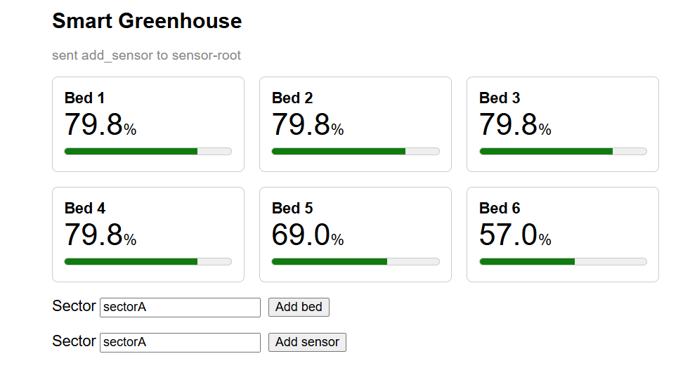
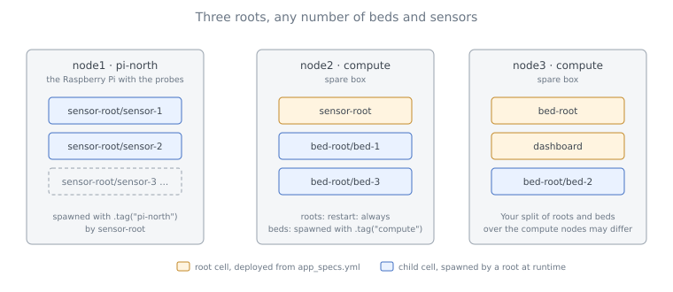

# Scaling Your Application

Every cell you have deployed so far was a **root**: listed in `app_specs.yml`, deployed by the CLI, one instance per line. A real greenhouse does not work like that. Beds are added over the season and sensors are screwed to whichever Raspberry Pi is nearest, and nobody wants to edit a file and redeploy for each one. In this tutorial a root cell **spawns** other cells at runtime, and you learn what that means for identity, placement, and what happens when a node dies.

> **Preview version.** Restart policies apply to root cells only. A spawned cell is not restarted by the swarm; its parent is told that it was lost and decides what to do. This tutorial shows how to make that decision with the tools available today. The [Roadmap](../09_roadmap.md) describes how supervision becomes something the swarm does by itself.

## Prerequisites

- Completed the [Smart Greenhouse](./02_smart-greenhouse.md): you know what the grow-bed and the sensor do, and how the dashboard reaches the browser.
- Completed [Resilience](./03_resilience.md): you know what placement tags, restart policies and `myrmic replicate` do.
- No Myrmic runtime running. If one is, stop it: `myrmic runtimes delete <name>`.

You will use three terminals:

| Terminal | Runs |
|---|---|
| Terminal 1 | your working shell: start and kill runtimes, deploy, send |
| Terminal 2 | `myrmic subscribe` or `myrmic telemetry debug` - a live view |
| Terminal 3 | the gateway, from Part 4 on |

The finished code is in the repository under `examples/scaling-greenhouse`. The tutorial builds it in a fresh `scaling/` workspace so nothing you do here touches your Smart Greenhouse.

## Tutorial Parts

1. [A Root That Spawns](./04_scaling/01_roots-that-spawn.md) - build a bare grow-bed and a bed root, and spawn three beds from the CLI into two sectors - **learning how one cell creates another, and where it runs.**
2. [Bringing Beds Back](./04_scaling/02_bringing-beds-back.md) - kill the node a bed runs on, then the node the root runs on, and teach the root to bring its beds back - **learning how a parent is told about a lost child and how it rebuilds its tree after its own restart.**
3. [One Sensor per Bed](./04_scaling/03_one-sensor-per-bed.md) - build a sensor root, spawn one mock sensor per bed from the CLI, and pair each bed with its own sensor by name - **learning how spawned cells find each other and how a cell filters a broadcast event.**
4. [The Dashboard](./04_scaling/04_the-dashboard.md) - put the greenhouse on a web page with two inputs that add beds and sensors from the browser - **learning how a browser sends commands into the swarm through the gateway.**
