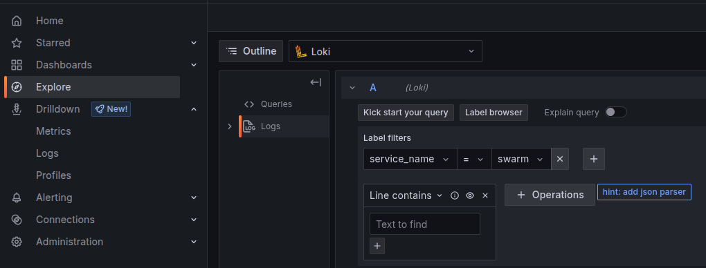
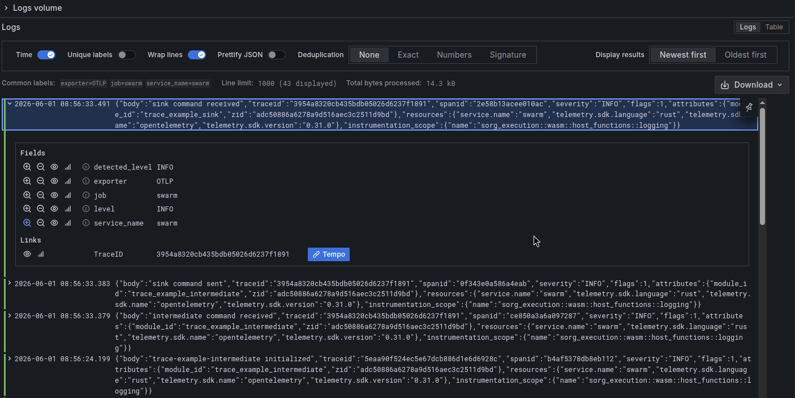
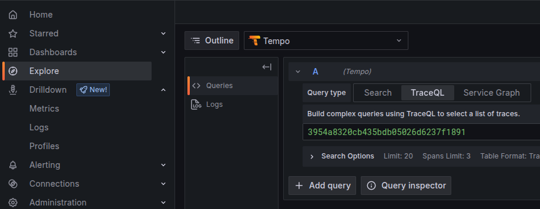
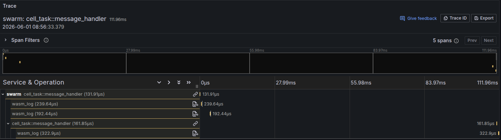
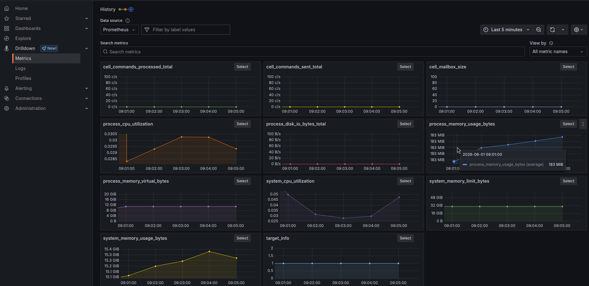
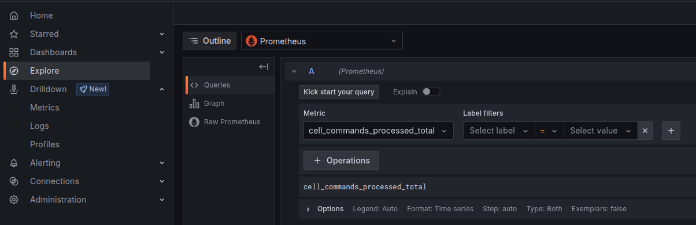
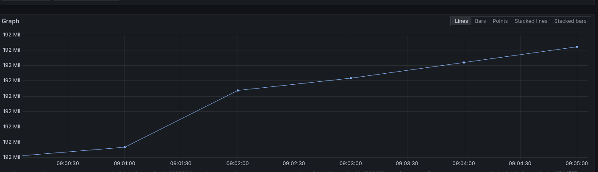

# Observability

## What is Observability and Why Does it Matter?

Observability answers the question: *"What is my swarm actually doing right now?"*

A running swarm is a distributed system - multiple nodes communicating over a P2P layer. Without observability you are flying blind: when something goes wrong (a cell stalls, a message loop spikes latency, memory climbs) there is no way to diagnose it from the outside.

Swarm exposes three complementary signals:

| Signal | What it tells you | Where it lives |
|--------|-------------------|----------------|
| **Logs** | Timestamped text events from every node | Loki / `myrmic telemetry logs` |
| **Traces** | Distributed call trees showing how work flows through cells | Tempo / `myrmic telemetry traces` |
| **Metrics** | Numerical counters and gauges (memory, message counts, …) | Prometheus / `myrmic telemetry metrics` |

Each signal can be routed to one or both destinations, depending on how Myrmic is built and configured:

- **Internal DB** - requires Myrmic compiled with the `telemetry` feature (on by default). Queryable with the `myrmic telemetry` CLI without any extra infrastructure.
- **OpenTelemetry (OTel) export** - requires Myrmic compiled with `--features open-telemetry` *and* `otel_endpoint` set in the runtime config. Pushes data to any OTel-compatible collector. The demo docker-compose stack routes this to Grafana/Loki/Tempo/Prometheus, but any other OTel stack works too.

Neither destination is guaranteed to be active by default - you get the CLI alone, the Grafana export alone, both, or neither, depending on your build and configuration.

---

## Prerequisites

- Completed the First Cell Quickstart (TBD).
- Rust toolchain & Cargo - required to build Myrmic from source. Install via [rustup](https://rustup.rs/) if not already set up.
- Docker & Docker Compose *(optional - only needed for the Grafana visualization stack)*.
- The swarm repository checked out locally - the Myrmic source live here.

---

## Step 1 - Build Myrmic with OpenTelemetry Support

The OpenTelemetry exporter is opt-in at compile time. Run:

```bash
cd <path/to/your/repo/root>
cargo build --bin myrmic --features open-telemetry
```

Without this flag, the runtime will **not** push data to any external collector. Internal DB recording is still available, but only if the `telemetry` feature is compiled in - it is a default feature, so it is included unless you explicitly opt out.

You might want to install the Myrmic binary to your system which simplifies the next steps as the `myrmic` command is used directly in this tutorial:
```bash
cd <path/to/your/repo/root>
cargo install --path swarm/myrmic-cli/ --features open-telemetry
```

---

## Step 2 - Start the Grafana Stack (Optional)

For local testing, a ready-made Docker Compose file is provided under `docker/otel-stack/`. It starts:

| Service | Purpose | Default address |
|---------|---------|-----------------|
| **OpenTelemetry Collector** | Receives OTel data from Myrmic | `localhost:4317` (gRPC), `localhost:4318` (HTTP) |
| **Grafana Tempo** | Stores and queries distributed traces | internal |
| **Grafana Loki** | Stores and queries log streams | internal |
| **Prometheus** | Stores and queries metrics | internal |
| **Grafana** | Visualization UI for all of the above | `http://localhost:3000` |

### Install Docker (Ubuntu/Debian)

Install the Docker engine and the Compose plugin (v2):

```bash
sudo apt install docker.io docker-compose-v2
```

Verify both are installed and working:

```bash
docker --version           # e.g. Docker version 24.0.x
docker compose version     # e.g. Docker Compose version v2.x.x
```

> **Note:** The Compose command is `docker compose` (with a space, v2 plugin). The older standalone `docker-compose` (with a hyphen, v1) may not support all features in the provided config.

For other platforms, follow the [official Docker installation guides](https://docs.docker.com/engine/install/).

#### Optional: Rootless Mode

By default Docker requires root privileges. Running it in rootless mode improves security by not exposing the Docker daemon as root:

```bash
sudo apt install uidmap
curl -fsSL https://get.docker.com/rootless | sh
```

After the script completes, follow the printed instructions to add the rootless socket to your environment. Commands like `docker compose up` will then work without `sudo`.

See the [rootless Docker docs](https://docs.docker.com/engine/security/rootless/) for more.

### Start the Stack

```bash
cd <path/to/your/repo/root>
cd docker/otel-stack
docker compose up -d
```

The `-d` flag detaches the stack so it runs in the background. Omit it to see the stack's own log output inline.

Grafana is then accessible at **http://localhost:3000** (no login required in the default dev config).

### Stop the Stack

```bash
docker compose down          # stop containers, keep recorded data
docker compose down -v       # stop containers AND delete all recorded data (clean slate)
```

---

## Step 3 - Configure the Runtime

By default Myrmic logs to stdout only. To enable OTel export, add a `telemetry` section to your runtime configuration file (YAML):

```yaml
myrmic:
  telemetry:
    otel_endpoint: "http://localhost:4317"   # OTel collector gRPC endpoint
    logs:
      filter: "info"                         # Log filter (see below)
```

### Full Configuration Reference

```yaml
myrmic:
  telemetry:
    # Push logs, metrics and traces to this OTel collector endpoint (gRPC).
    # Remove this key entirely to disable OTel export.
    otel_endpoint: "http://localhost:4317"

    logs:
      # Controls the format of log lines printed to the swarm process's stdout.
      # Has no effect on OpenTelemetry export.
      # Options:
      #   FULL    - timestamp + level + target + fields (default)
      #   COMPACT - same as FULL but without source location
      #   PRETTY  - human-friendly multi-line output, good for development
      #   JSON    - machine-readable JSON, good for log aggregators
      format: "PRETTY"

      # Filter which log records are emitted.
      # Syntax: <target>=<level> or just <level>
      # Examples:
      #   "info"                     - info and above from all targets
      #   "debug"                    - everything debug and above
      #   "swarm=debug,warn"         - debug for swarm crates, warn for everything else
      #   "debug,h2=warn,zenoh=off"  - debug overall, suppress noisy libraries
      # If omitted, the RUST_LOG environment variable is used as a fallback.
      filter: "swarm=info,warn"
```

> **Tip**: The `otel_endpoint` field enables export for **all three signals** (logs, metrics, traces) at once. There is no per-signal toggle in the YAML config.

### Example: Minimal Config (CLI Only, No Grafana)

```yaml
myrmic:
  telemetry:
    logs:
      filter: "info"
```

### Example: Full Config With Grafana

```yaml
myrmic:
  telemetry:
    otel_endpoint: "http://localhost:4317"
    logs:
      filter: "swarm=debug,warn"
```

---

## Step 4 - Start the Runtime

```bash
myrmic runtime start path/to/your/config.yml
```

Once the runtime is running, it begins collecting telemetry. You can now query it with the CLI or inspect it in Grafana.

---

## Step 5 - Generate Some Activity

Deploying any application will immediately produce log lines. To see traces you need to trigger actual cell activity - a deployed cell handling a command or an event produces a trace.

If you have the `hello-room` app from the quickstart, it is enough:

```bash
# Deploy the application (produces log lines on startup)
myrmic deploy dist

# Send a few events to produce traces and update metrics
myrmic event "temperature-measurement"
myrmic event "temperature-measurement"

# Call a command - this also produces a trace
myrmic send room get_temperature
```

After these steps you should have logs, traces, and metrics to inspect.

---

## Step 6 - Inspect Telemetry

### Using the CLI

The `myrmic telemetry` subcommand queries the **internal DB** directly - no Grafana required.

#### View Logs

```bash
myrmic telemetry logs
```

Shows all stored log entries sorted by time, colour-coded by severity. Each entry includes a timestamp, severity level, and message. When a log entry belongs to a trace, the trace ID is printed inline.

```bash
# Filter to only logs from a specific distributed trace
myrmic telemetry logs --trace-id <uuid>
```

> **Debugging: `DEBUG`/`TRACE` records are hidden by default.** `myrmic telemetry logs` reuses
> the CLI's own `-v` verbosity flag to decide which stored severities to print - not a separate
> query filter. `ERROR`, `WARN`, and `INFO` records always show, but `DEBUG` and `TRACE` records
> are suppressed unless you ask for them, even though they're already sitting in the DB (as long
> as the runtime's `logs.filter` let them through when they were recorded - see [Step 3](#step-3---configure-the-runtime)):
>
> ```bash
> # Also show DEBUG-level records
> myrmic telemetry logs -v
>
> # Show everything, including TRACE-level records
> myrmic telemetry logs -vv
> ```
>
> This only affects `myrmic telemetry logs`. `myrmic telemetry traces` always dumps every stored
> span regardless of verbosity - trace data isn't leveled the way logs are.

#### View Traces

```bash
myrmic telemetry traces
```

Outputs all stored trace spans in the [Trace Event Format](https://docs.google.com/document/d/1CvAClvFfyA5R-PhYUmn5OOQtYMH4h6I0nSsKchNAySU/preview) (also known as the Chrome trace format). The output is JSON you can pipe to a file and open in a browser:

```bash
# Save and open in Perfetto (free, browser-based trace viewer)
myrmic telemetry traces > trace.json
# Open https://ui.perfetto.dev/ and drag-drop trace.json
```

```bash
# Or filter to a single trace
myrmic telemetry traces --trace-id <uuid>
```

#### View Metrics

```bash
myrmic telemetry metrics
```

Prints the **latest snapshot** of all metrics: counters, gauges, and byte-based metrics (displayed as human-readable sizes like `1.23 MiB`). Each metric is shown with its name, value, and all associated attributes (e.g. node ID, cell type).

#### Change the Log Filter at Runtime

You can change what log levels are collected **without restarting any node**. The new filter is broadcast to all connected nodes instantly:

```bash
# Crank up verbosity to debug a problem
myrmic telemetry set-filter "swarm=debug,warn"

# Back to normal
myrmic telemetry set-filter "swarm=info,warn"

# Silence noisy libraries but keep debug for your own crate
myrmic telemetry set-filter "debug,h2=warn,zenoh=off"
```

Filter syntax follows the `tracing` crate's `EnvFilter` format.

#### Manage DB Retention

By default, telemetry data accumulates in the internal DB indefinitely. Use retention to bound storage:

```bash
# Keep only the last 15 minutes of data
myrmic telemetry set-db-retention "15min"

# Keep the last 2 hours
myrmic telemetry set-db-retention "2h"

# Keep 1 day and 30 minutes
myrmic telemetry set-db-retention "1day 30min"

# Disable retention - data is never purged (default)
myrmic telemetry no-db-retention
```

Retention changes are applied to all connected nodes immediately.

#### Live Debug Stream

The commands above all inspect data that's already been recorded. `myrmic telemetry debug` is different: it stays running and streams activity **as it happens**, until you press Ctrl-C or a `--timeout` elapses.

```bash
myrmic telemetry debug
```

It shows two kinds of items, printed in timestamp order as they occur:

- `COMMAND` - a command sent to a specific cell (i.e. a mailbox command), including its receiver SRI, trace ID (if any), and payload.
- `EVENT` - a published event, including its name, trace ID (if any), and payload.

Payloads are printed as JSON if they parse as JSON, otherwise as a string, otherwise as raw hex bytes - whichever is most readable.

If the swarm you're pointed at has DB-backed telemetry available (the default - see the signal table at the top of this chapter), matching log records are interleaved right alongside the command/event that triggered them, in timestamp order. Unlike `myrmic telemetry logs`, this interleaved log output is **not** gated by `-v`/`-vv` - every stored severity, including `DEBUG` and `TRACE`, is always shown here. This is what sets `debug` apart from `logs`/`traces`/`metrics`: instead of separate views you have to mentally line up by trace ID, you get one merged stream showing the command/event alongside every log line it caused, in the order they actually happened:

```
[2026-07-22T10:15:03.120Z] COMMAND=update receiver_sri=asset.object.0, trace_id=030a7dc5-8454-43a5-81c2-6f3e7a885edd, payload="xxxxxxxx..."
[2026-07-22T10:15:03.121Z] DEBUG TIER-1-BENCH-0-CALL-0 sri=asset.object.0
[2026-07-22T10:15:03.130Z] EVENT=central_update payload={"zone_id":0}, trace_id=030a7dc5-8454-43a5-81c2-6f3e7a885edd
[2026-07-22T10:15:03.131Z] DEBUG TIER-3-BENCH-0-CALL-0 sri=bridge.central
```

The `COMMAND`/`EVENT` lines come from `debug`'s own item formatting; the `DEBUG ...` lines in between are log records emitted while handling them, rendered the same way as `myrmic telemetry logs` (`[time] LEVEL message`) but without a repeated trace ID, since it's already shown on the item above.

```bash
# Only stream activity addressed to one cell, stop automatically after 30s
myrmic telemetry debug --id asset.object.0 --timeout 30s

# Machine-readable output, e.g. to pipe into jq
myrmic telemetry debug --json | jq .

# Temporarily change cell log level
myrmic telemetry debug --level DEBUG | jq .
```

> **Note:** `--id` (SRI or SRN) filters `COMMAND` items to the given receiver and filters logs to that cell's attribute, but it suppresses `EVENT` items entirely - events aren't naturally tied to a single receiver, so there's nothing meaningful to filter them by.

This is usually the fastest way to answer "what is actually happening in my swarm right now" while reproducing an issue interactively, rather than reproducing it first and then digging through `logs`/`traces` afterwards.

---

### Using Grafana

If you have the Grafana stack running, open **http://localhost:3000**. The main tool for ad-hoc inspection is the **Explore** view, accessible from the left sidebar (compass icon). In Explore you pick a data source from the dropdown at the top - Loki for logs, Tempo for traces, Prometheus for metrics - and then build queries interactively. See the [Grafana Explore documentation](https://grafana.com/docs/grafana/latest/explore/) for a general introduction.

#### Checking Logs in Grafana

Logs are stored in [Loki](https://grafana.com/docs/loki/latest/) and queried using [LogQL](https://grafana.com/docs/loki/latest/query/).

1. Open **Explore** and select **Loki** from the data source dropdown at the top of the page.

   

2. In the query builder that appears, click **+ Add label filter** and set `service_name = swarm`. This narrows results to swarm nodes. You can add further filters - for example `severity = error` to show only errors. When ready, click **Run Query** in the top-right corner.

   

   Log lines are shown newest-first in the results panel below the query builder. Each line shows the timestamp, log level badge, and message. You can expand any entry to see all attached key-value attributes.

3. Any log entry that belongs to a distributed trace will show a **Tempo** button on the right side of the row. Clicking it opens the full trace directly - this is the fastest way to go from a log message to the trace that produced it.

> **Tip:** If you already know a trace ID (e.g. from `myrmic telemetry logs`), paste it into the LogQL query as `{service_name="swarm"} | trace_id = "<id>"` to see only log lines from that trace.

#### Checking Traces in Grafana

Traces are stored in [Grafana Tempo](https://grafana.com/docs/tempo/latest/) and queried using [TraceQL](https://grafana.com/docs/tempo/latest/traceql/).

Traces can be reached two ways:

- **From a log entry**: click the **Tempo** button next to any log line that has a trace ID (see above).
- **Directly**: open **Explore**, select **Tempo** from the data source dropdown, then either search by trace ID or use the **Search** tab to filter by service name, span name, duration, or tags.

  

The trace view renders a timeline of spans. Each row is one span - a unit of work inside a single node. In swarm, spans typically appear sequentially: a parent span finishes before the spans it triggered appear, reflecting the asynchronous, message-driven nature of the system rather than a synchronous call stack. The horizontal position and width of each bar show when a span started and how long it took, making it easy to see the order of operations and spot latency between steps. Clicking a span expands a detail panel showing all its attributes.



#### Checking Metrics in Grafana

Metrics are stored in [Prometheus](https://prometheus.io/docs/introduction/overview/) and queried with [PromQL](https://prometheus.io/docs/prometheus/latest/querying/basics/). See the [Grafana Prometheus data source docs](https://grafana.com/docs/grafana/latest/datasources/prometheus/) for Grafana-specific query options.

Two ways to explore metrics:

**Metrics Drilldown** (easiest for exploration): open the **Drilldown** app from the left sidebar. It lists all metric names reported by the swarm, grouped by prefix. Click any metric to see its current value, a time-series graph, and a breakdown by label. No PromQL knowledge required.



**Explore view** (for precise queries): open **Explore** and select **Prometheus** as the data source. Type a metric name in the query field - Grafana will autocomplete from the known metric list. From here you can apply PromQL functions such as `rate()` for per-second rates.



Results appear as a time-series graph and a table of raw data points below. Use the time range picker in the top-right corner to zoom in on a specific incident window.



---

## Quick-Start Checklist

Use this to get up and running in one go:

```bash
# 1. Build Myrmic with OTel support
cargo build --bin myrmic --features open-telemetry

# 2. Start the Grafana stack
cd docker/otel-stack && docker compose up -d && cd -

# 3. Create a minimal runtime config
cat > my-runtime.yml <<EOF
myrmic:
  telemetry:
    otel_endpoint: "http://localhost:4317"
    logs:
      filter: "swarm=info,warn"
EOF

# 4. Start the runtime
myrmic runtime start my-runtime.yml

# 5. In another terminal - deploy an app and generate some activity
myrmic deploy dist
myrmic event "temperature-measurement"
myrmic event "temperature-measurement"
myrmic send room get_temperature

# 6. Inspect telemetry
myrmic telemetry logs
myrmic telemetry metrics
myrmic telemetry traces

# 7. Open Grafana (Linux: xdg-open, macOS: open)
xdg-open http://localhost:3000
```

---

## Troubleshooting

**`myrmic telemetry logs` shows nothing**
: The runtime must be running. Check that it started without errors.

**No data in Grafana**
: Check that `otel_endpoint` is set in the runtime config **and** that Myrmic was compiled with `--features open-telemetry`. The binary silently skips OTel export if the feature is not compiled in.

**Too much noise in logs**
: Use `myrmic telemetry set-filter "<target>=info,warn"` at runtime to suppress verbose output without restarting.

**A `DEBUG` or `TRACE` log I expect isn't showing up in `myrmic telemetry logs`**
: Two independent filters are in play. First, the runtime's `logs.filter` config (or `myrmic telemetry set-filter`) controls what's recorded into the DB at all - if it's set to `"info"`, `DEBUG`/`TRACE` records are never stored in the first place. Second, even once a record *is* stored, `myrmic telemetry logs` hides `DEBUG`/`TRACE` severities by default - pass `-v` (show `DEBUG`) or `-vv` (show `TRACE`) to the CLI command itself, e.g. `myrmic telemetry logs -vv --trace-id <uuid>`.

**Grafana shows stale / old data only**
: If you restarted the runtime without cleaning volumes, old data may still be present. Run `docker compose down -v` in `docker/otel-stack/` to wipe everything and start fresh.

**OTel collector connection refused**
: Confirm the Docker stack is up (`docker compose ps` in `docker/otel-stack/`) and that port `4317` is not blocked by a firewall.
