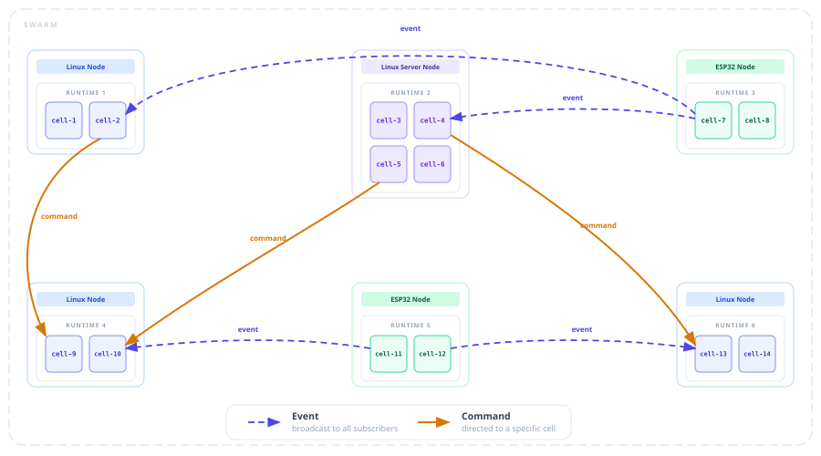

# Cells

A cell is the fundamental unit of computation in Myrmic - a self-contained Wasm module that runs inside an isolated sandbox.

Because cells are Wasm modules, the same binary runs on a Linux host or on embedded hardware like the ESP32.

A cell has a defined role: it handles commands, reacts to events, and stores data. Myrmic solutions are composed of cells.

Each cell is identified by its unique SRN (Stable Resource Name) - the address it is reached at.

The **Myrmic SDK** powers the cell model with the functionality to build scalable solutions - such as inter-cell messaging, data storage, hardware peripherals, scheduling, and integrations with external systems both inbound and outbound.

And then there is the **Myrmic CLI**, bringing your cell-driven application to life by providing everything from scaffolding to deployment.

This guide covers cells and their basic usage in practice. The SDK's broader capabilities are covered in dedicated guides.

## A cell in code

In code, a cell is a Wasm module compiled from a Rust source file. The easiest way to create one is with [`myrmic new`](../10_reference/02_myrmic-cli/01_new.md) - it creates a crate with the cell source and its build configuration, ready to build and run.

```bash
myrmic new my-cell
```

The result looks like:

```
my-cell/
  Cargo.toml
  src/
    lib.rs
```

`Cargo.toml` wires up the Myrmic SDK dependency and controls the cell's runtime memory - heap size, stack size, and linear memory limits. See [Cell and Application Configuration](../10_reference/01_configuration/02_cell-and-application-configuration.md) for all available options.

The cell definition lives inside `src/lib.rs` - it looks like this:

```rust
#![no_std]

use myrmic_sdk::db::state::State;
use myrmic_sdk::{Callback, JsonValue, Metadata};

const STATE: State<i32> = State::new_const("my-key");

#[myrmic_sdk::init]
fn init(md: Metadata) -> myrmic_sdk::Result {
    let _ = myrmic_sdk::info!("starting (id={:?})", md.id).ok();
    Ok(())
}

#[myrmic_sdk::cmd]
fn count(md: Metadata, callback: Callback<JsonValue>) -> myrmic_sdk::Result {
    let _ = myrmic_sdk::info!("returning count to (sender={:?})", md.sender).ok();

    let value = STATE.load()?.unwrap_or_default();

    callback.invoke(md.sender, &JsonValue::from(value))?;

    Ok(())
}

#[myrmic_sdk::cmd]
fn increment(md: Metadata) -> myrmic_sdk::Result {
    let count = STATE.upsert_with(|count| {
        *count = *count + 1;
    })?;

    let _ = myrmic_sdk::info!("Incremented count to {} (sender={:?})", count, md.sender).ok();

    Ok(())
}

#[myrmic_sdk::cmd]
fn decrement(md: Metadata) -> myrmic_sdk::Result {
    let count = STATE.upsert_with(|count| {
        *count = *count - 1;
    })?;

    let _ = myrmic_sdk::info!("Decremented count to {} (sender={:?})", count, md.sender).ok();

    Ok(())
}
```

The code above defines a cell that keeps a counter in state and exposes three commands to read and modify it. Simple on the surface - but there are a few things here worth more explaining.

- **No standard library** - Cells run on both Linux hosts and bare-metal embedded hardware, so the Rust standard library is not available. The Myrmic SDK provides alternatives for the things you are most likely to need from the standard library.

- **State** - `State<T>` is a typed handle to a state value that persists. It lives on the runtime database - not in Wasm memory. By default it is private to the cell. See [State and Storage](./06_state-and-storage.md) for more information and how to use it.

- **Initialization handler** - Runs once when the cell is first deployed. Use it for any initialization logic your cell needs - setting up initial state, logging startup info, or running custom business logic before the cell starts handling requests. It can also accept initialization args that are passed at deploy time. Here is an example:

    ```rust
    use serde::Deserialize;

    #[derive(Deserialize, myrmic_sdk::Message)]
    struct Config {
        start: i32,
        step: i32,
        min: i32,
        max: i32,
    }

    #[myrmic_sdk::init]
    fn init(_md: Metadata, config: Config) -> myrmic_sdk::Result {
        let _ = myrmic_sdk::info!("starting at {}", config.start).ok();

        // do something with config

        Ok(())
    }
    ```

    To pass init args at deploy time, use `--init` or `--init-file` with [`myrmic deploy`](../10_reference/02_myrmic-cli/05_deploy.md), or `instance_data` / `instance_data_file` in the [Application Configuration](../10_reference/01_configuration/02_cell-and-application-configuration.md#application).

    If your cell has nothing to initialize, omit it entirely.

- **Commands and Events** - the cell exposes command and event handlers - functions the runtime calls when work arrives or something happens in the swarm. Covered in detail in [Commands](./02_commands.md) and [Events](./03_events.md).

- **Timers** - cells can schedule work to run at a fixed interval or after a delay. Covered in detail in [Scheduling Handlers](./05_scheduling-handlers.md).

## Application

As a solution grows, cells and bridges (adapters that translate external protocols like MQTT or HTTP into the swarm) need to be managed together. An application is how Myrmic organizes them - it groups multiple cells and bridges into a single deployable unit defined by a YAML specification file.

See [Cell and Application Configuration](../10_reference/01_configuration/02_cell-and-application-configuration.md#application) for the full reference.

## Structuring your project

When a project grows beyond a single cell, you need to decide how to organize your cells. There are two approaches:

1. **Multiple cells in one crate** - cells share the same memory config and dependencies. Good for tightly coupled cells.

   An example for a project structure looks like:

   ```
   my-cells/
     Cargo.toml
     src/
       lib.rs        ← shared code and cell setup
       bin/
         sensor.rs
         actuator.rs
   ```

   The relevant entries in `Cargo.toml`:

   ```toml
   [[bin]]
   name = "sensor"
   path = "src/bin/sensor.rs"

   [[bin]]
   name = "actuator"
   path = "src/bin/actuator.rs"
   ```

   An application configuration for this setup looks like:

   ```yaml
   classes:
     - id: sensor
       build:
         path: .
         target: sensor
     - id: actuator
       build:
         path: .
         target: actuator

   instances:
     - class: sensor
       sri: sensor
     - class: actuator
       sri: actuator
   ```

   To build or deploy a single cell from the crate, pass `--target` to select which bin to use - see [`myrmic build`](../10_reference/02_myrmic-cli/03_build.md) and [`myrmic deploy`](../10_reference/02_myrmic-cli/05_deploy.md) for details.

2. **Workspace** - each cell has its own memory config and dependencies. Add a `common` crate for shared types. Good for independent cells.

   An example of project structure looks like:

   ```
   my-app/
     Cargo.toml        ← workspace manifest
     common/           ← shared types
       Cargo.toml
       src/lib.rs
     sensor/
       Cargo.toml
       src/lib.rs
     actuator/
       Cargo.toml
       src/lib.rs
   ```

    In workspace manifest file:

   ```toml
   [workspace]
   members = ["common", "sensor", "actuator"]
   ```

   An application configuration for this setup looks like:

   ```yaml
   classes:
     - id: sensor
       build:
         path: ./sensor

     - id: actuator
       build:
         path: ./actuator

   instances:
     - class: sensor
       sri: sensor
     - class: actuator
       sri: actuator
   ```

## Cell execution and placement

A cell does not run on its own - it runs inside the Myrmic runtime.
The Myrmic runtime is the process that runs on a device - Linux or embedded - connects it to the swarm, and manages every cell deployed to it: spinning up their Wasm sandboxes, routing messages to the right cells, and handling each cell's lifecycle from deployment to teardown.

The Myrmic CLI provides the means to manage runtimes - see [runtimes start](../10_reference/02_myrmic-cli/04_runtimes/01_start.md), [list](../10_reference/02_myrmic-cli/04_runtimes/02_list.md), and [delete](../10_reference/02_myrmic-cli/04_runtimes/03_delete.md).

Cells are event-driven. When a command arrives, an event fires, or a timer triggers, the runtime calls the matching handler in the cell. Between calls, the cell is idle. Each cell runs in full isolation - no access to the filesystem, network, or other cells except through what the SDK offers.

The result is a heterogeneous swarm - Linux machines alongside embedded devices - each powered by a runtime, each runtime hosting one or more cells, all communicating as if connected directly:



By default, a deployed cell can land on any available runtime in the swarm. This works for most cells - but in a heterogeneous swarm, some cells need specific hardware or capabilities that only certain devices provide.

This is solved with placement tags - information about what a runtime offers and what a cell requires:

- a runtime advertises capability tags at startup
- a cell declares the tags it requires at deploy time

The swarm places the cell only on a matching runtime. Tags and execution behavior are configurable - see [runtimes start](../10_reference/02_myrmic-cli/04_runtimes/01_start.md), [`myrmic deploy`](../10_reference/02_myrmic-cli/05_deploy.md), [Cell and Application Configuration](../10_reference/01_configuration/02_cell-and-application-configuration.md#application), and [runtime configuration](../10_reference/01_configuration/01_runtime-configuration.md#execution) for all available options.

## Myrmic CLI

You may have noticed throughout this guide that several CLI commands were introduced. The Myrmic CLI offers the necessary means to scaffold, build cells for Linux and embedded targets, deploy, and manage them at runtime. For the full list - with synopsis, options, and usage examples for each command - see the [Myrmic CLI Reference](../10_reference/02_myrmic-cli.md).

## See also

- [Commands](./02_commands.md) - how to accept input and pass data between cells
- [Events](./03_events.md) - how to publish and subscribe to events
- [Schedule Handlers](./05_scheduling-handlers.md) - how to schedule work at a fixed interval or after a delay
- [State and Storage](./06_state-and-storage.md) - working with state and storage
- Bridges *(TBD)* - adapters that translate external protocols into the swarm
- [Cell and Application Configuration](../10_reference/01_configuration/02_cell-and-application-configuration.md) - memory layout and application spec reference
- [Myrmic CLI Reference](../10_reference/02_myrmic-cli.md) - full CLI command reference

## Related SDK reference

- [Cell initialization](../10_reference/03_myrmic-sdk/01_cell-model/01_cell-initialization.md)
- [Cell identity and metadata](../10_reference/03_myrmic-sdk/01_cell-model/02_identity-and-metadata.md)
- [Cell classes and spawning](../10_reference/03_myrmic-sdk/04_cell-lifecycle/01_cell-classes-and-spawning.md)
- [Cell termination](../10_reference/03_myrmic-sdk/04_cell-lifecycle/02_cell-termination.md)
- [Cell monitoring](../10_reference/03_myrmic-sdk/04_cell-lifecycle/03_cell-monitoring.md)
