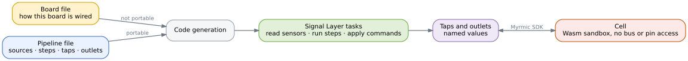

# Work with the Signal Layer

A cell might need to interact with the physical world. It may need to read the temperature of a room, or switch a light on and off.

A cell cannot do this on its own. It runs as a Wasm module inside a sandbox, and that sandbox has no direct access to hardware. The cell cannot directly reach the temperature sensor, and it cannot drive the relay that switches the light.

The Signal Layer closes that gap. It knows how the hardware is wired, it does the reading and writing, and it gives the cell an interface to work with. The Myrmic SDK provides the functions a cell uses to reach it.

Cells also come and go. They are deployed, replaced and removed while the node they run on stays up throughout, and the hardware work cannot stop each time that happens. The Signal Layer starts when the node starts, as part of the firmware on a microcontroller and as its own process on Linux, before any cell exists, and it keeps reading its sensors and running its loops whether a cell is present or not. That is the second reason the hardware description lives outside the cell: it has to outlive the thing that consumes it.

For a single pin there is also a direct GPIO interface, provided by the Myrmic SDK. The Signal Layer is for everything beyond that: a device on a bus, a value that needs processing before a cell sees it, or hardware you want to describe once and reuse.

## What a cell sees

A cell sees two things: taps and outlets.

A **tap** is a named value the cell can read. You choose the names in your pipeline, so a pipeline built around a room sensor might offer `temperature` and `humidity`. A tap is filled in by the Signal Layer, not by the cell.

An **outlet** is a named value the cell can write, named the same way. Writing to an outlet is how a cell switches a light on or sets the speed of a fan.

There are two kinds of taps you can declare. A **retained** tap always holds the most recent value the pipeline produced, and reading it gives you that value. An **event** tap is a queue of values the pipeline produced: reading it returns and consumes the oldest one, so each event is delivered once. A third kind, batch, is reserved for planned work and cannot be used yet.

A cell does not need to know in advance what taps and outlets a node offers. The SDK lets a cell list what is available and decide from there.

## When things happen

The Signal Layer reads sensors and writes outlet values to actuators on its own schedule, in loops. The rates of those loops are defined in the pipeline.

This means the cell is an observer. It does not decide when a sensor is read. When it writes to an outlet, it does not decide when that value reaches the actuator either.

**This is not a real-time system.** If a cell reads a tap twice in quick succession it may get the same value twice, because the loop that fills that tap has not run in between.

Every retained tap value carries a timestamp, so a cell can tell a fresh value from one it has already seen. The timestamp counts milliseconds since the node's Signal Layer started, so it is useful for comparing two readings against each other. It is not a wall clock time, and an event tap carries no timestamp at all.

## The pipeline

If you think of the parts as building blocks, the pipeline is the building instructions.

The pipeline names the parts of the system, says how they are connected, and gives each one its parameters. A sensor produces a value. That value can go to a tap for a cell to read, or into a processing step, or on to an outlet.

Two words will keep coming up. A **driver** is the piece of the Signal Layer that knows one kind of device: how to initialise a particular sensor and read it, or how to make a particular actuator act. And the **generator** is the build tool that reads your configuration files and produces the Signal Layer that runs them: tasks inside the firmware on a microcontroller, a standalone process on Linux. Nothing you write in the files is interpreted at run time; the generator turns it into code first.

Steps can be chained, so the output of one step becomes the input of the next.

Because the output of a step can drive an outlet directly, a pipeline can close the loop by itself. A pipeline that reads a temperature, decides a fan speed and writes it to the fan needs no cell to do the control work. It keeps working even with no cell running at all, and a cell that is running becomes purely an observer.

## What a step is

A step is a small piece of processing with one input and one output. A moving average is a step, and so is tracking the smallest or largest value seen.

Steps run as native code inside the pipeline's own loop, close to the sensor that feeds them.

You can also do some arithmetic inside your cell instead. Prefer a step when the value must keep flowing without a cell, or when the result is needed as fast as the sensor produces it.

## Where each setting belongs

There are two files, and knowing which one a setting belongs in is most of the work.

The **board file** describes the physical setup: which pin is wired to which sensor pin, the address of a device on a bus. This is fixed by the hardware. A finished product does not rewire itself, so the board file describes the world the pipeline runs in.

The **pipeline file** holds everything that can change without touching the wiring, such as how often a sensor is read.

The rule is:

- If the hardware decides it, it belongs in the board file.
- If you could change it without changing the wiring or the circuit board, it belongs in the pipeline file.

Each driver, the per-device piece introduced above, declares which settings it has, which of the two files each one belongs in, and a default. A setting you do not write down keeps its default. Settings in the pipeline are given per device, so two sensors on the same board can be read at different rates.

## What you will do

1. [Describe your hardware](./11_signal-layer/01_describe-your-hardware.md) in the board file.
2. [Design your pipeline](./11_signal-layer/02_design-your-pipeline.md): the parts, their connections and their parameters.
3. [Read values](./11_signal-layer/03_read-values.md) and [know when hardware fails](./11_signal-layer/04_know-when-hardware-fails.md).
4. [Drive hardware](./11_signal-layer/05_drive-hardware.md) from your cell.
5. [Discover what a node offers](./11_signal-layer/06_discover-what-a-node-offers.md) when you cannot know in advance.
6. [Write your own driver](./11_signal-layer/07_write-your-own-driver.md) for a sensor or actuator that is not supported yet.
7. [Write your own step](./11_signal-layer/08_write-your-own-step.md) to transform values in flight.

The pages that follow take these in order.

## Embedded and Linux

The pipeline file is portable. The same sources, steps, taps and outlets describe the system on both platforms, and a cell written against a tap does not change when the hardware underneath does.

The board file is not portable, and it is not meant to be. It describes one specific board. It names the chip, and it says how each device is reached: on embedded that means the pins a bus uses, and on Linux it means the kernel device path instead. What does carry over is the list of devices, because a sensor keeps the same driver and the same address wherever you plug it in.

Both platforms support sensors over I2C and SPI, actuators, and processing steps. The [reference](../10_reference/04_signal-layer/05_running-on-linux.md) states what each platform supports and how the board file differs on Linux.

The platforms also run the Signal Layer differently. On embedded it is part of the firmware, so it is there whenever the cell is. On Linux it is a separate process that has to be running before a cell can use it.

That difference has one symptom worth knowing. On Linux, if every tap a cell asks for comes back as not present, check that the pipeline process is running before you check the names in your pipeline file. A cell cannot tell the difference between a tap that does not exist and a pipeline that is not there.
