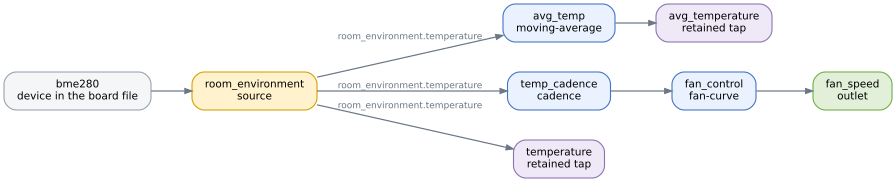

# Design your pipeline

The board file says what your hardware is. The pipeline says what to do with it: which devices
produce readings, what happens to those readings on the way through, and what a cell is
allowed to see and change. If the board file is the parts list, the pipeline is the
instructions.

Unlike the board file, the pipeline is portable. It names devices, not pins, so the same
pipeline runs against any board whose devices match.

## Four parts, and one idea

A pipeline has four kinds of entry:

**Sources** turn a device into a stream of readings. **Steps** do something to a reading on
the way past. **Taps** are the values a cell can read. **Outlets** are the values a cell can
write.



The idea that connects them is that everything you declare has a name, and you wire things
together by naming them. There are three forms a reference can take:

| Reference | Means |
|---|---|
| `room_environment.temperature` | an output of the source `room_environment` |
| `temp_cadence` | the output of the step `temp_cadence` |
| `relay_cmd.contact` | a feedback-capable outlet's read-back of its real state |

Wherever a pipeline asks for an input, a source or a tap's origin, it accepts one of those
three. The first two are in the diagram above; the third is not, because it only exists for an
outlet whose device can read its own state back: such an outlet publishes that read-back as a
value, and the feedback section later on this page shows one. An outlet also exposes `.error` in
the same form, carrying faults rather than a reading.

## Sources

A source binds a device from your board file and says how to run it.

```yaml
sources:
  - id: room_environment
    device: bme280
    config:
      sample_interval_ms: 1000
      osrs_t: X4
      filter: X4
```

`device` has to match a device id in the board file, and `id` is the name you will use to
refer to this source's readings. They need not be the same, and `room_environment` says more downstream
than `bme280` does.

Everything under `config` is a setting the driver marked as belonging to the application:
how often to sample, how much to oversample, how hard to filter. Settings fixed by the
hardware, like the device's address, are not here. They are in the board file, and putting one
in the wrong place is an error rather than a preference.

## Steps

A step takes one input, does something, and produces an output under its own name.

```yaml
steps:
  - id: avg_temp
    op: moving-average
    input: room_environment.temperature
    config:
      window: 8
```

`op` names the step module. The ones used here are examples rather than the whole set, which
the [step reference](../../10_reference/04_signal-layer/04_steps.md) lists in full. A step has exactly **one** input, which keeps the wiring easy
to follow, and you build longer chains by pointing one step at another:

```yaml
  - id: temp_cadence
    op: cadence
    input: room_environment.temperature
    config:
      every: 4
      mode: SampleHold

  - id: fan_control
    op: fan-curve
    input: temp_cadence
    config:
      in_min: 25.0
      in_max: 40.0
      out_min: 0.0
      out_max: 1.0
```

Chains may fan out. Several steps can take the same input, so one cadenced temperature can
feed a fan curve and a threshold controller at once. What they may not do is form a loop: the
generator sorts the step graph and rejects a cycle, naming the steps involved.

The wiring is type-checked. If a step expects an `f32` and you feed it something else, you get
told which step, which input and which types, before anything is built.

### Two places to control the rate

A source has a sampling interval, and `cadence` can thin a path further downstream. It looks
like duplication and it is not: the source rate is one decision, and each branch after a
fan-out can make its own.

That is the reason the two exist. A pipeline might sample every 500 ms because a cell wants
temperature that fresh, while a controller on the same reading only needs to recompute every
couple of seconds. Setting the source slower would degrade the cell's view; cadencing the
controller's branch costs the cell nothing.

A second reason follows from it: filters need samples to work with. A `moving-average` over
eight samples is only meaningful if samples arrive often enough for eight of them to describe
something. Sampling fast and thinning afterwards keeps that true.

A step may also produce nothing for a while. A moving average has no answer until its window
fills. When a step yields nothing, whatever it feeds simply is not updated, and a tap
downstream of it keeps whatever it held before, and holds nothing at all the first time round.
That differs from a failed sensor, where the pipeline actively clears the tap.

## Taps

A tap publishes a value under a name a cell can look up.

```yaml
taps:
  - name: temperature
    kind: retained
    type: f32
    source: room_environment.temperature

  - name: avg_temperature
    kind: retained
    type: f32
    source: avg_temp
```

`source` is any of the three reference forms, so a tap can publish a raw driver output, the
result of a step, or an outlet's read-back.

There are two kinds you will use. A **retained** tap holds the latest value with its
timestamp, and reading it does not consume it, which is what you want for a measurement that
is simply true right now. An **event** tap is a queue of things that happened, which the
reader drains, and is what you want for alarms and state changes where missing one matters.

A third kind, `batch`, appears in the format but is reserved for planned work. It is not
quietly ignored: declaring one fails generation with `batch taps not yet supported by
codegen`.

Taps are your cell-facing interface, so choose them deliberately rather than exhaustively.
Publish what a cell will actually use. Intermediate values inside a chain do not need to be
taps just because they exist, though tapping one is a reasonable way to make a decision
visible when you want to see why it was taken.

## Outlets

An outlet is a value a cell can write, wired to a device that can act on it.

```yaml
outlets:
  - name: heat_relay
    type: DigitalState
    device: relay1
```

`type` is the value type the device's driver accepts, `DigitalState` for an on/off output
and `PwmDuty` for a duty fraction, and it is checked against the driver rather than trusted.
A device can be driven by exactly one outlet, so there is never a question of who is writing
to it.

Outlets report their own failures. Any outlet exposes an error event you can tap, which is
how a cell finds out that a write did not take effect:

```yaml
taps:
  - name: relay_fault
    kind: event
    type: OutletFault
    source: heat_relay.error
```

A device wired with a feedback line offers more. Its driver reads the real state back on a
separate input, and that read-back is available as a tap source too. It has to be an outlet on
a feedback-capable device, so here it is a second outlet on a different relay:

```yaml
outlets:
  - name: relay_cmd
    type: DigitalState
    device: relay_fb

taps:
  - name: relay_contact
    kind: retained
    type: bool
    source: relay_cmd.contact
```

`contact` is a genuine read of the feedback line rather than an echo of the last write,
which is the whole point of a hybrid driver. Ask a plain output for it and generation fails
with `driver declares no status output 'contact'`.

## Deciding where control lives

An outlet can also be driven from inside the pipeline, by giving it an `input`:

```yaml
outlets:
  - name: fan_speed
    type: PwmDuty
    device: fan1
    input: fan_control
```

Now the fan curve drives the fan directly and no cell is involved. The same job could be done
by a cell reading a temperature tap and writing `fan_speed` itself, so the interesting
question is which to choose.

Put the decision **in the pipeline** when it has to be as fast as possible, or has to keep
working regardless of any cell. Pipeline logic runs whether a cell is loaded, being replaced,
or has crashed, and it does not wait for anything outside the layer.

Put the decision **in a cell** when it is a higher-level one, or when it needs something only
a cell has: the network, BLE, other devices in the swarm, or history beyond the reading in
front of it.

The short version is reflexes in the pipeline, judgement in the cell. A reflex consults
nothing and must not stop; a judgement weighs context and can afford to be reloaded.

This is about behaviour and independence, not about safety. The Signal Layer makes no safety
guarantees, and in-layer control should not be chosen on the belief that it does.

## Closing the loop

Loops are allowed and useful, in more than one shape.

The ordinary one goes through the physical world: an outlet changes something, a sensor
notices, and the next reading reflects it. Nothing in the pipeline is circular here, so
nothing objects.

A tighter one goes through an outlet's read-back. Where a device reports its real state, as
`relay_cmd.contact` does, a step can consume that and act on it.

Be careful here: a step whose input does not resolve is not reported. It is dropped from the
generated pipeline silently, so a typo, or a status field the driver does not have, costs you
the step without an error.

What is not allowed is a cycle among steps. That is caught during generation, because a step
graph that loops has no order to run in.

## What the generator checks

Most mistakes in a pipeline are caught before anything is built, and the messages name the
entry at fault: a source pointing at a device the board does not have, a reference that
resolves to nothing, a type mismatch between what a step wants and what feeds it, an outlet
whose value type the driver does not accept, two outlets on one device, duplicate names, a
cycle in the step graph, an application setting that belongs in the board file.

What it cannot check is intent. Nothing will tell you that a threshold is wrong for your room
or that you cadenced away resolution a controller needed. For that, run it and watch.
