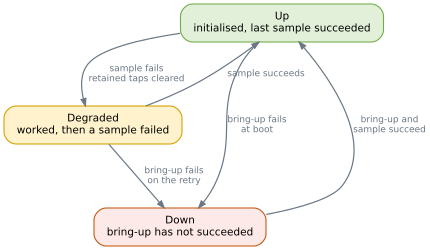

# Know when hardware fails

Sensors come loose. A bus goes quiet. A device that answered a moment ago stops answering. The
Signal Layer notices, and it tells you in two ways: the reading disappears, and an event says
what changed.

This page is about the second one. It follows on from reading values, because the question it
answers is the one an empty reading leaves open: is there no value yet, or has something broken?

The SDK provides the tools needed to hear about this: health arrives on an ordinary event tap, so
a cell reads it with the same functions it uses for any other value.

## Three states

Every source in a pipeline is in one of three states.

**Up.** The driver initialised and its last sample succeeded. This is the ordinary state and the
one a pipeline starts in.

**Degraded.** A sample failed on a source that had been working. The pipeline clears that
source's retained taps, so reads return no value rather than a stale one, and it re-runs the
driver's bring-up on the next tick to try to recover.

**Down.** Bring-up itself has not succeeded, either at boot or after a failure knocked the source
back into bring-up. Nothing has been published, so there is nothing to clear.

The two failure states differ in what they tell you. `Degraded` means it worked and then stopped.
`Down` means it never got going. A sensor you forgot to wire reports `Down` forever; a sensor
whose jumper falls out reports `Degraded` and then keeps trying.

Recovery is automatic in both cases. The source re-runs bring-up every tick, and the first
successful sample puts it back to `Up`.



## Where the state is published

Any pipeline with at least one source publishes an event tap called `_signal_layer_health`. You
do not declare it; codegen adds it. A pipeline with no sources has no health tap, because there
is nothing to report on.

Each event carries which source changed and what it changed to:

```rust
use myrmic_sdk::signal_layer::{DriverHealth, HealthEvent};
use myrmic_sdk::tap::Tap;

let Some(health) = Tap::resolve("_signal_layer_health")? else {
    return Ok(());  // a pipeline with no sources
};

while let Some(event) = health.take_event_typed::<HealthEvent>()? {
    match event.state {
        DriverHealth::Up => myrmic_sdk::info!("source {} recovered", event.source)?,
        DriverHealth::Degraded => myrmic_sdk::warn!("source {} degraded", event.source)?,
        DriverHealth::Down => myrmic_sdk::warn!("source {} is down", event.source)?,
    }
}
```

Drain it in a loop, the same as any event tap. Events accumulate between your polls.

## The source is a number, not a name

`event.source` is an index, not an identifier. It is the position of the source in your pipeline
file, counting from zero, and **nothing maps it back to a name for you**.

So if your pipeline lists `room_environment`, `light` and `air_quality` in that order, `source: 1` means
`light`. If you insert a source above it, the same sensor becomes `source: 2` and a cell written
against the old numbering silently reports the wrong device.

Until there is a name in the event, the practical options are to keep the mapping in the cell as
a constant and treat the pipeline's source order as an interface, or to report the raw index and
resolve it by hand when reading logs. Neither is satisfying. If you take the first, put a comment
in the pipeline file saying the order is load-bearing, because nothing else will warn whoever
edits it next.

## What silence means

There is no way to ask for the current health. The tap carries transitions, not state, and
**there is no event at startup**: a pipeline begins by assuming every source is `Up` and only
speaks when that changes.

Remember the timelines involved: the pipeline starts with the node and runs whether or not any
cell is deployed, and cells are placed whenever the swarm decides, possibly much later. For a
cell that comes up together with the node, the convention works. No news is good news.

For a cell deployed later it is a trap. If a sensor failed an hour before your cell was loaded,
the transition happened while nobody was listening, and your cell sees an empty queue that looks
exactly like everything being fine.

Two things soften this, and neither fixes it. The queue holds the last few events rather than
only the newest, so a recent failure may still be waiting when you start. And a source that is
`Degraded` keeps failing and recovering, so it will usually announce itself again before long.

The reliable signal is the reading itself. If a tap you expect a value from returns nothing, that
source is not currently healthy, whatever the event queue says. Use the health events to learn
*what* went wrong and *when*; use the empty reading to know *that* something is wrong.

## Events are taken, not observed

An event tap is a queue with a single consumer. Taking an event removes it for everyone.

That matters here more than for other taps, because health is the sort of thing several cells
might want. If two cells both drain `_signal_layer_health`, each sees roughly half the events and
neither sees the full picture, with no error to indicate anything is wrong.

If more than one cell needs to know about hardware failures, have one cell drain the tap and
republish what it learns, rather than having each read the tap directly.

The queue also has a bound. When it is full the oldest event is dropped to make room, so a cell
that polls slowly during a burst of failures loses the beginning of the story rather than the
end. That is the right way round, but it does mean the first thing that went wrong is the first
thing you lose.

## What this does not cover

Driver health is about the hardware a pipeline talks to. It says nothing about whether the node
is reachable, whether cells are running, or whether the device is keeping up. Those are separate
questions with their own answers: the runtime's own liveness supervision, and the observability
tooling that reports on nodes, cells and logs.

A source reporting `Up` means its last sample succeeded. It does not mean the value is correct,
only that the device answered.
