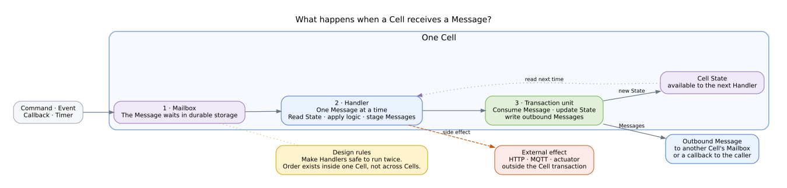

# Handlers, State, and Transactions

A **Handler** is a Cell's reaction to one Message. It is also the conceptual boundary for a state transition.

## One Message at a time

Commands, Events, callbacks, and timer wake-ups form one ordered stream for a Cell.

One Handler runs at a time. A slow Handler delays everything behind it, including timers, so long-running work should be handed to another Cell.

## The command-handler unit

The model groups three operations:

- consuming the inbound Message,
- changing the Cell's State,
- writing outbound Messages.

This unit is local to one Node. A destination mailbox whose data lives on another Node remains outside that local transaction boundary until Continuity adds support across Nodes.

The exact current behaviour after a Handler fails is release-sensitive. It is stated only on the [Guarantees](../08_guarantees.md) page.

## Idempotency is part of the interface

The same logical work can reach a Handler more than once. This can happen when a caller sends again, a redeployment overlaps, or a commit does not complete cleanly.

Design every Handler so that running it twice is harmless.

## External effects sit outside the transaction

HTTP calls, MQTT publishes, and actuator writes leave the Cell transaction.

Without a sink that supports request identity, deduplication, or fencing, applications must accept at-least-once effects and design accordingly.

## Back-pressure

The in-memory queue between mailbox delivery and the Cell is bounded. When a Cell is slower than its incoming work, delivery pauses and leaves work in persistent storage rather than silently dropping it.

The current resource and throughput limits are preview constraints, not performance promises.

## Timers

Timers join the same Handler stream. Their durability across a Cell restart is a guarantee question. In the preview, timer and Event positions are process-local.

## See also

- [Where Data Lives](./05_where-data-lives.md) - durability and replication for Cell State
- [Guarantees](../08_guarantees.md) - what the current release promises, and what it doesn't yet
