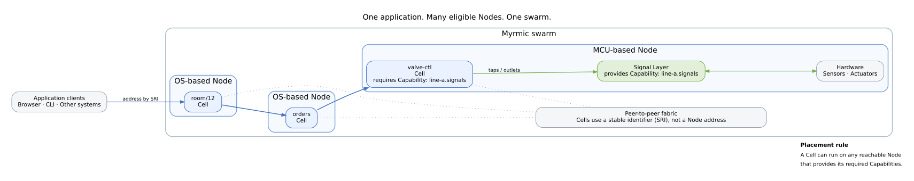

# The Swarm View

The Swarm view answers one question:

> **Where does my code run?**

## The Application spans Nodes

Myrmic can place the Cells in one Application on different Nodes:

- `room/12` runs on an OS-based Node,
- `orders` runs on another OS-based Node,
- `valve-ctl` runs on an MCU-based Node next to its Signal Layer Capability.

They remain one Application even though their execution is distributed.

## Identity is independent of location

Cells address each other by a **Stable Resource Identifier (SRI)**. A sender targets `orders`, not the IP address or process currently running it.

This keeps Application relationships stable when placement changes.

## Capabilities constrain placement

A Cell can run on any reachable Node that provides its declared Capabilities.

The `valve-ctl` Cell requires `line-a.signals`, so Myrmic places it with the native Signal Layer module that provides that Capability. The requirement is explicit rather than hidden in deployment scripts.

## One peer-to-peer fabric

OS-based and MCU-based Nodes participate in the same peer-to-peer fabric. Browser, CLI, and other external clients reach Cells through application-facing gateways. Cells continue to communicate by SRI.

The Swarm view intentionally does not explain authority, data replication, or failure stages. Those questions have their own diagrams.

## See also

- [Architecture](../07_architecture.md) - the four views and the six layers
- [Nodes and the Swarm](../06_concepts/02_nodes-capabilities-and-the-swarm.md) - the concepts behind this view
