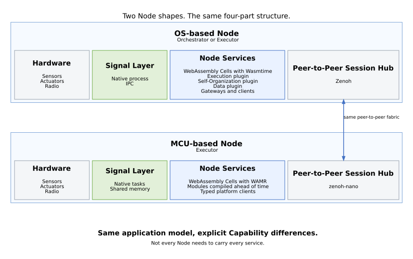

# The Node View

The Node view answers:

> **What runs on a device?**

Both Node shapes use the same four-part structure:

1. hardware,
2. Signal Layer,
3. Node services,
4. Peer-to-Peer (P2P) Session Hub.

The difference is how much platform functionality each Node carries locally.

## OS-based Node

An OS-based Node can operate as an Orchestrator or Executor.

Its Node services can include:

- WebAssembly Cells through Wasmtime,
- the Execution plugin,
- Self-Organization services,
- Data services,
- gateways and Application clients.

Its Signal Layer runs as a native process connected through inter-process communication (IPC). The P2P Session Hub uses Zenoh.

## MCU-based Node

An MCU-based Node operates as an Executor.

It runs:

- WebAssembly Cells through WAMR with modules compiled ahead of time,
- typed clients for platform services,
- native Signal Layer tasks that use shared memory.

The P2P Session Hub uses `zenoh-nano`. Other Nodes in the swarm can provide orchestration and full Data services.

## Same model, explicit differences

Both Node classes expose Cells to the same Application model and peer-to-peer fabric. They do not pretend to have identical resources.

Capabilities make the differences explicit, and placement uses those Capabilities when deciding where a Cell can run.

> **Not every Node needs to carry every service.**

## See also

- [The Six Layers](./05_the-six-layers.md) - the canonical layers every Node runs
- [Connecting Physical Systems](../02_why-myrmic/04_connecting-physical-systems.md) - how Cells relate to native drivers and hardware I/O
