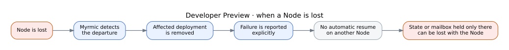
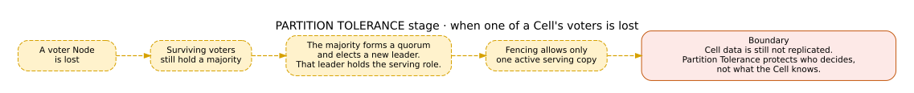
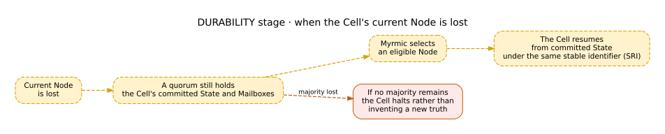

# Failure Behaviour

Failure behaviour is easier to understand when each stage has its own diagram.

The [Guarantees](../08_guarantees.md) page remains authoritative for the current release. Partition Tolerance and Durability below are roadmap stages, not preview capabilities.

## Developer Preview - remove and report

Today, when a Node is lost:

- Myrmic detects the departure,
- affected deployments are removed,
- the failure is reported explicitly,
- the Cell does not automatically resume on another Node,
- State or Mailbox data held only on the lost Node can be lost with it.

This is conservative by design. Starting an empty Cell under the old identity would claim continuity that did not actually exist.

## Partition Tolerance - authority survives

**Partition Tolerance is a roadmap stage.** It replicates authority: who may decide and serve. Every Cell has a voter set of several Nodes, and a decision about the Cell is valid once a majority of them — a quorum — has agreed to it.

When a voter is lost and the surviving voters still form a majority:

- they form a quorum and elect a new leader, who takes the serving role,
- fencing allows only one active serving copy,
- authority no longer depends on one coordinator.

Partition Tolerance does **not** replicate Cell State or Mailboxes.

> **Partition Tolerance protects who decides, not what the Cell knows.**

## Durability - committed data survives

**Durability is a roadmap stage.** It replicates Cell State and Mailboxes across several Nodes; a write is committed once a quorum of them has stored it.

When the current Node is lost and a majority remains:

- the committed State and Mailbox remain available,
- Myrmic selects an eligible Node,
- the Cell resumes from committed State under the same SRI.

If no majority remains, the Cell halts rather than inventing a new truth. Recovery then requires an explicit action by a Swarm Admin.

> **Together, Partition Tolerance and Durability make a Cell sovereign over its Node.**

## Boundaries at every stage

- A missing callback means the outcome is unknown.
- External side effects need idempotency, deduplication, or fencing.
- No stage creates global order across Cells.
- Software cannot create physical redundancy for a unique sensor or actuator.

## See also

- [Guarantees](../08_guarantees.md) - what the current release promises, and what it doesn't yet
- [Roadmap](../09_roadmap.md) - what future stages are intended to add
