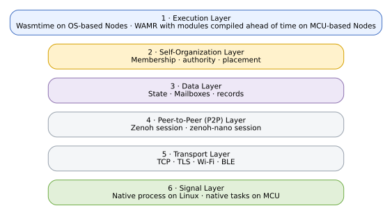

# The Six Layers

Myrmic uses one canonical layer model across concepts, architecture, and reference documentation.

| Layer | OS-based Node | MCU-based Node | Primary concern |
| --- | --- | --- | --- |
| **1 · Execution** | Wasmtime Execution plugin | WAMR with modules compiled ahead of time | Cell execution and effects |
| **2 · Self-Organization** | Self-Organization plugin | Services provided by the swarm | Membership, authority, placement |
| **3 · Data** | Data plugin | Access through typed clients | State, Mailboxes, records |
| **4 · Peer-to-Peer (P2P)** | Zenoh session | `zenoh-nano` session | Shared carrier and protocol fabric |
| **5 · Transport** | TCP, TLS, BLE | Wi-Fi, BLE | Physical links |
| **6 · Signal** | Native process over IPC | Native tasks over shared memory | Hardware-near acquisition and control |

## Important boundaries

- The Signal Layer is native on both Node classes.
- Gateway and CLI surfaces are ingress clients, not architecture layers.
- MCU-based Nodes participate through typed clients rather than carrying the full plugin topology.
- Roadmap stages strengthen authority and data guarantees without changing this visible layer model.

## See also

- [Architecture](../07_architecture.md) - the four views and the six layers
- [Understanding Myrmic](../02_why-myrmic/02_understanding-myrmic.md) - where these six layers fit in the bigger picture
