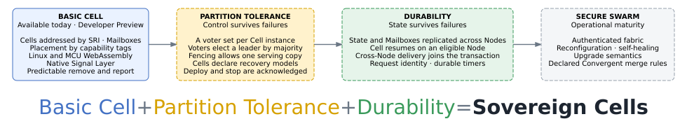

# Roadmap

Myrmic is released as a developer preview. The current preview already implements a number of key concepts, and these are being expanded with additional features. This page gives an overview of the current state, of the final goal, and of the stages in between.

Rather than publish dates, this roadmap names the **guarantee each stage closes** and the **demonstration that proves it**. A stage is complete when users can reproduce its demonstration, not when a date arrives.

## The Current Implementation: Basic Cell

One runtime for stateful distributed applications:

- Cells with durable identities, addressed by a Stable Resource Identifier (SRI),
- tracked and best-effort delivery through Mailboxes,
- WebAssembly isolation from Linux systems down to supported MCUs,
- placement by capability tags,
- a generated native Signal Layer for sensors and actuators,
- failure handling that is conservative and predictable.

When a Node is lost, its deployments are removed and the loss is reported. The preview does not claim that a Cell automatically resumes elsewhere with its State intact. What a Swarm Admin can already do is configure replication of a Cell's data to selected Nodes by hand. This gives a basic form of failover today: the data survives the Node, and the Cell can be redeployed where a replica lives.

**Try it:** run the quickstart, place a Cell by capability tags, and compare what happens after Node loss with the guarantee page.

## The Final Goal: Sovereign Cells

Today a Cell lives and dies with its Node. The final goal of the roadmap is to turn that around: a **Sovereign Cell** is a Cell that outlives the Node it runs on. Its identity, its authority, and its data are all replicated, so that losing any single Node changes *where* the Cell runs, but not *whether* it runs, *what* it knows, or *who* it is. Application code is written once, against a Cell, and the Swarm takes care of keeping that Cell alive.

Two properties make a Cell sovereign:

- **Partition tolerance.** The Swarm keeps working correctly when a Node disappears or the network splits into parts that cannot reach each other. For every Cell there is, at all times, exactly one place that may decide and serve — never none, and never two. For the developer this means no split-brain, no coordinator that has to be kept alive, and lifecycle operations that either take effect once or report that they did not.
- **Durability.** Everything a Cell has acknowledged survives the loss of a Node, and the Cell resumes on another Node with exactly the State it had. For the developer this means no hand-written replication or recovery logic inside the application: **kill a Node, keep the Cell.**

Both properties come with one deliberate limit. If a Consistent Cell loses its majority, it halts rather than inventing a new truth. Recovery then requires a deliberate action by a Swarm Admin.

> **Basic Cell + Partition Tolerance + Durability = Sovereign Cells.** A Cell whose authority and data are both replicated can outlive its Node. Partition Tolerance alone preserves the decision about who may serve, while the Cell's data can still be lost with its Node; only with Durability does the Cell's State itself survive.

Finally, a Swarm in production also has to withstand adversaries and change: Nodes and Cells must prove who they are, Nodes must join and leave while Cells keep running, and upgrades need defined semantics. These concerns form the last stage of the roadmap, **Secure Swarm**.

## The Roadmap Stages

The stages below are ordered by dependency: each builds on the guarantees of the one before it, and each is complete when its demonstration can be reproduced.

### Partition Tolerance - replicate authority

The decisive step towards partition tolerance is deciding who has authority over each Cell. Authority means the right to make the runtime decisions about a specific Cell — which Node may run it, whether a deploy or stop has taken effect, and which of two copies is the real one. The mechanism that assigns this authority must satisfy two conditions: it must be fully decentralised, with no coordinator Node that all others depend on, and it must itself survive failures — a Node loss or a partition cannot leave any Cell without a way to reach a decision.

The current proposal is to obtain this through a **quorum-based** approach. Every Cell instance is assigned a small group of Nodes, its voter set. A decision about that Cell is valid only once a majority of its voter set — a quorum — has agreed to it, and the voter set elects one of its members as leader to propose decisions and collect votes. Because the voter set is per Cell, authority is per Cell as well: different Cells can be governed by different Nodes.

Leadership, membership, and serving authority thus stop depending on one coordinator and become majority decisions. This mechanism does **not** replicate Cell State or Mailboxes: it preserves the decision about who may serve while the Cell's data still exists in one place.

The quorum-based approach adds:

- authority held by a voter set of several Nodes, not by one coordinator,
- a leader elected by each Cell's voter set,
- fencing, so that only one copy of a Cell is ever actively serving,
- recovery models declared by Cells,
- deploy and undeploy operations that are idempotent and acknowledged.

Together these five properties enable what we call Partition Tolerance: no single Node holds the decisions about a Cell, a split network cannot produce two serving copies, and every lifecycle operation either takes effect once or reports that it did not.

Partition Tolerance is a runtime cutover, not a side-by-side feature flag: once a Swarm runs it, every Cell is governed this way.

**Demonstration**: stop the Node that currently leads a Cell. Leadership moves to another voter within seconds, and no Cell serves twice. The scenario can be replayed from a seed.

### Durability - replicate data

Durability makes **what the Cell knows** survive.

The Cell's committed State and Mailboxes are replicated across several Nodes, and a write is acknowledged only once a majority of them has stored it. Every write operation that a Consistent Cell has acknowledged therefore survives the loss of one Node, and the Cell can resume on another eligible Node with exactly the State it had.

The replicated data approach adds:

- atomic delivery of Messages across Nodes,
- request identity and deduplication,
- durable timers,
- Cell resume with committed State after Node loss.

Together these properties enable what we call **Durability**: nothing a Cell has acknowledged is lost with a single Node, and the Cell comes back where a copy of its data lives.

**Demonstration:** **Kill a Node. Keep the Cell.**

### Secure Swarm - operate with trust

Secure Swarm makes the Swarm **trustworthy to run in production**. Sovereign Cells survive failures; Secure Swarm adds what a Swarm Admin needs to trust the Nodes they run on and to keep the Swarm running over time:

- an authenticated fabric with a full key lifecycle, so that Nodes and Cells carry cryptographic proof of where they come from,
- membership reconfiguration, so that Nodes can join or leave a Cell's voter set without stopping the Cell,
- controlled self-healing,
- upgrade semantics,
- Convergent Cells with a declared, defensible merge rule.

## Durability is research before engineering

Only the first two steps towards Durability have a fixed order: measure what the Data Layer guarantees today, then choose the consistency target. Everything after that depends on the evidence. Every proposed design must survive review, and two have already been rejected.

The roadmap will not publish dates or performance numbers before the corresponding design and evidence exist.

## See also

- [Guarantees](./08_guarantees.md) - what the current release promises, and what it doesn't yet
- [Architecture](./07_architecture.md) - the four views and the six layers
