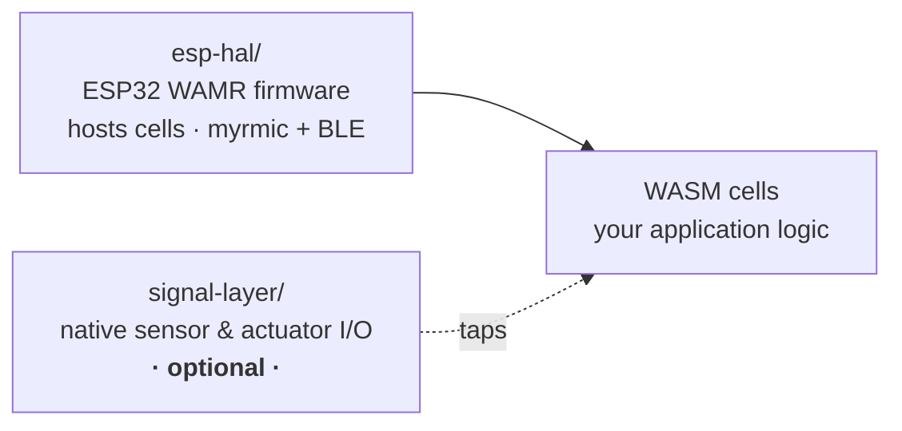

# Embedded

On-device firmware and the native layers it runs on. The embedded firmware turns a supported
ESP32 into a **myrmic swarm node** that hosts WebAssembly **cells** — the application logic —
on the WAMR runtime, reachable over WiFi (myrmic transport) and BLE (user transport).

The **Signal Layer** is an *optional* native layer that feeds those cells sensor readings and
drives actuators. It matters when a cell needs hardware I/O, but the firmware hosts cells with
or without it — a networking- or GPIO-only cell needs none of it.

## What's in here

| Directory                          | What it is                                                                                                                                                              |
| ---------------------------------- | ---------------------------------------------------------------------------------------------------------------------------------------------------------------------- |
| [`esp-hal/`](esp-hal/)             | The ESP32 firmware ecosystem and **the core of the embedded stack**: the WAMR WASM runtime that hosts cells, the `modem-esp32` firmware (myrmic + BLE transports, flash/AOT layout, memory tuning), and low-level crates (MMU, storage). **Start here.** |
| [`signal-layer/`](signal-layer/)   | **Optional** native I/O layer: sensor **drivers**, actuator outputs, processing **steps**, and the **tap registry** cells read from. Chip-agnostic — the ESP-specific glue (board manifests, pipelines, `esp-codegen`) lives under [`esp-hal/signal-layer/`](esp-hal/signal-layer/). |
| [`examples/`](examples/)           | Runnable example firmware binaries (onboarding and Zenoh-ping over BLE and TCP).                                                                                        |
| [`hil-tests/`](hil-tests/)         | Hardware-in-the-loop tests that flash real boards and assert against live behaviour.                                                                                    |

> Cells themselves aren't here — they're WASM modules under [`../sdk/`](../sdk/). This tree
> is the firmware that hosts them and the native layers it exposes to them.

## Where to start

- **New to the embedded stack?** Read [`esp-hal/README.md`](esp-hal/README.md) — the WAMR
  firmware, the supported-chip capability matrix, and how a WASM cell is built, AOT-compiled,
  flashed, and run.
- **Writing or running a cell?** Cells live in [`../sdk/`](../sdk/) (see
  [`../sdk/README.md`](../sdk/README.md) and the examples in
  [`../tests/fixtures/`](../tests/fixtures/), e.g. `blinky`). The **WASM
  Operation** section of [`esp-hal/README.md`](esp-hal/README.md) covers compiling and loading
  one.
- **Running on real hardware?** The **Debugging with serial printouts** section of
  [`esp-hal/README.md`](esp-hal/README.md) flashes and monitors a board (`cargo run-c6`, …).
- **Need sensor or actuator I/O?** *(optional)* Start at
  [`signal-layer/README.md`](signal-layer/README.md); to add a device see
  [the driver guide](../doc/chapters/05_guides/11_signal-layer/07_write-your-own-driver.md); for the ESP
  wiring, boards, and pipelines see [`esp-hal/signal-layer/`](esp-hal/signal-layer/), with the
  end-to-end hardware runbooks under [`esp-hal/signal-layer/docs/`](esp-hal/signal-layer/docs/)
  (`hardware-test-sensors.md` for the read side, `hardware-test-actuators.md` for the write side).
