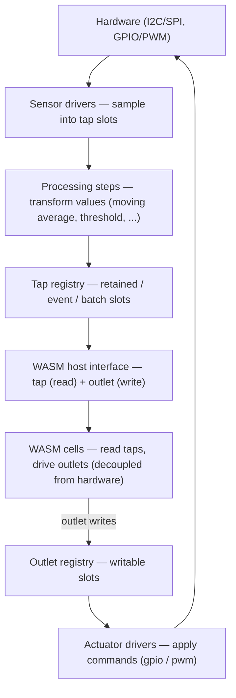

# Signal Layer

The Signal Layer is the platform-independent native layer that owns sensor drivers, actuator
outputs, processing steps, and the named tap/outlet registries. It sits between the hardware
and the WASM cells: sensor drivers sample hardware into named **tap** slots (optionally
transformed by processing steps), and cells read those taps — while cells drive actuators by
writing named **outlet** slots that actuator drivers apply back to the hardware. Both
directions cross the WASM boundary through a narrow, non-blocking host interface.

The crates here are chip-agnostic. The ESP32-specific pieces (board manifests, pipelines,
the `esp-codegen` binary, and the `modem-esp32` firmware) live under
`../esp-hal/signal-layer/` and `../esp-hal/modem-esp32/`.

## Crate map

| Crate                | Purpose                                                                                                                                                                       |
| -------------------- | ----------------------------------------------------------------------------------------------------------------------------------------------------------------------------- |
| `signal-layer-types` | `#![no_std]`, serde-only payload types shared across the host↔WASM boundary: event/alarm payloads (`ThresholdAlarm`, `HealthEvent`, `OutletFault`), driver health (`DriverHealth`), and outlet command types (`DigitalState`, `PwmDuty`). |
| `signal-layer-core`  | Tap **and** outlet registries and their slot types (`RetainedSlot`, `EventSlot`, `BatchSlot`, `OutletRegistry`), the `ProcessingStep` trait, and `Timestamp`.                 |
| `drivers/*`          | One crate per device. **Sensors:** `bme280`, `bmp180`, `ads1115`, `ccs811`, `veml7700`, `wsen-itds`, `sim-source`. **Actuators:** `gpio-output`, `pwm-output`, `gpio-output-feedback`. Each has a `descriptor.yaml`. |
| `steps/*`            | One crate per processing step: `moving-average`, `max-value`, `min-value`, `threshold-trigger`, `hysteresis`, `fan-curve`, `cadence`. Each has a `descriptor.yaml`.           |
| `pipeline-codegen`   | Chip-agnostic code-generation library. Consumes a board manifest + pipeline and emits the firmware glue, with a `ChipBackend` seam for chip-specific peripheral construction. |

## Where to go next

- **Everything else** — the handbook is the source of truth: what the Signal Layer is and why
  it exists, describing hardware, designing a pipeline, reading values, driver health, driving
  hardware, and writing your own drivers and steps in
  [the guide](../../doc/chapters/05_guides/11_signal-layer.md); the pipeline and board file
  formats, the driver and step catalogues, and the platform matrix in
  [the reference](../../doc/chapters/10_reference/04_signal-layer.md).
- **Write a driver** — sensor and actuator drivers: [the driver guide](../../doc/chapters/05_guides/11_signal-layer/07_write-your-own-driver.md)
  (with an AI-agent prompt in
  [`signal-modules/docs/agent-create-driver.md`](../../signal-modules/docs/agent-create-driver.md)).
- **Run on real hardware** (ESP32-specific runbooks under `embedded/esp-hal/signal-layer/docs/`):
  - sensors / read side (wire, flash, read taps, verify health): [`hardware-test-sensors.md`](../../embedded/esp-hal/signal-layer/docs/hardware-test-sensors.md)
  - actuators / write side (outlets, PWM/relay, feedback): [`hardware-test-actuators.md`](../../embedded/esp-hal/signal-layer/docs/hardware-test-actuators.md)
